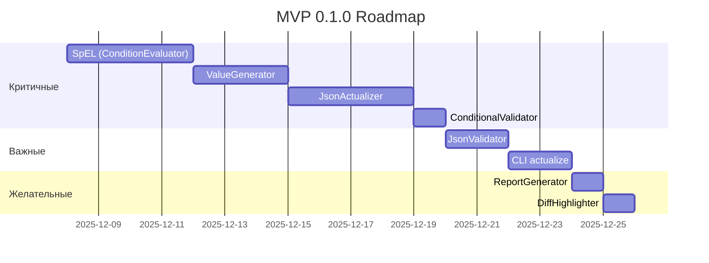

## 📋 MVP SCOPE

### **MVP 0.1.0 — "Актуализатор" (22-25 дней)**

**Основной use case:**
> У меня есть 100 готовых JSON-сценариев версии V070 из Postman.
> Вышла новая версия схемы V072 с новыми обязательными полями.
> **Мне нужно автоматически обновить все 100 файлов за минуты, а не дни.**

#### **Must-Have компоненты:**

**1. Анализ изменений** ✅ **ЗАВЕРШЕНО**

- [x] `SchemaParser` — парсинг любой версии JSON Schema
- [x] `SchemaComparator` — сравнение двух версий
- [x] `ChangeAnalyzer` — классификация CRITICAL/HIGH/MEDIUM/LOW
- [x] `analyze_changes.py` — CLI для анализа

**2. Актуализация** 🔴 **КРИТИЧНО (10-12 дней)**

- [ ] `ConditionParser` + `ConditionEvaluator` — SpEL (3-4 дня)
- [ ] `SpELFunctions` — 34 оператора (1-2 дня)
- [ ] `ConditionalValidator` — проверка УО полей (1 день)
- [ ] `ValueGenerator` — генерация значений для новых полей (2-3 дня)
- [ ] `JsonActualizer` — применение diff к JSON (3-4 дня)

**3. Валидация** 🟡 **ВАЖНО (2-3 дня)**

- [ ] `JsonValidator` — проверка JSON Schema + SpEL (2 дня)
- [ ] Отчет о валидации (1 день)

**4. CLI** 🟡 **ВАЖНО (2-3 дня)**

- [ ] `cli/main.py` с командами:
    - `compare` ✅ (уже есть в analyze_changes.py)
    - `actualize` 🔴 (основная команда)
    - `validate` 🟡

**5. Отчетность** 🟢 **ЖЕЛАТЕЛЬНО (2-3 дня)**

- [ ] `ReportGenerator` — Markdown/JSON отчеты
- [ ] `DiffHighlighter` — side-by-side JSON

**ИТОГО MVP:** **16-20 дней** (без генератора)

***

### **Версия 0.2.0 — "Генератор" (опционально, 10-15 дней)**

**Use case:**
> Я хочу сгенерировать тестовые сценарии для всех комбинаций продуктов автоматически,
> чтобы не писать JSON вручную.

#### **Should-Have компоненты:**

**1. Базовая генерация**

- [ ] `ScenarioGenerator` — генерация min/max сценариев
- [ ] Генерация для одного продукта (без комбинаторики)
- [ ] CLI: `generate --schema V072.json --product 10410001 --type min`

**2. Комбинаторная генерация**

- [ ] `CallMappingLoader` — загрузка Лист 19 Excel
- [ ] `isValidCombination()` — бизнес-правила
- [ ] Генерация матрицы: productCd × loanTypeCd × channelCd
- [ ] CLI: `generate-all --products 10410001,10410002`

***

### **Версия 1.0.0 — "Конфигуратор" (идея на будущее, 15-20 дней)**

**Use case:**
> Я хочу гибко настраивать, какие поля/комбинации генерировать,
> без редактирования кода или Excel.

#### **Could-Have компоненты:**

**1. Конфигурационный UI**

```yaml
# config/generation_rules.yml
version: "072"
scenarios:
  - name: "PACL Web MDM Min"
    product_cd: 10410001
    loan_type_cd: 10340001
    channel_cd: 10430001
    client_type: "mdm"
    fields:
      include:
        - loanRequest.creditAmt
        - loanRequest.customerForms
      exclude:
        - loanRequest.pledges  # явно исключить
    type: min
```

**2. Интерактивный выбор полей**

```bash
# CLI с интерактивным режимом
$ python -m src.cli generate --interactive

? Select product: 
  ❯ PACL (10410001)
    PACC (10410002)
    POS (10410005)

? Select channels (space to select):
  [x] Web (10430001)
  [ ] Office (10430003)
  [x] Mobile (10430002)

? Select fields to include:
  [x] loanRequest.creditAmt (required)
  [x] loanRequest.customerForms (required)
  [ ] loanRequest.pledges (optional)
  [x] loanRequest.consents (conditional)

Generating 2 scenarios (PACL_Web_min, PACL_Mobile_min)...
```

**3. Web UI для настройки**

- Визуальный конструктор сценариев
- Дерево полей с чекбоксами
- Предпросмотр JSON в реальном времени

***

## 🎯 ОБНОВЛЕННЫЕ ПРИОРИТЕТЫ

### **КРИТИЧНЫЕ (блокируют MVP):**

| Приоритет | Компонент | Дни | Статус | Зависимости |
| :-- | :-- | :-- | :-- | :-- |
| **P0** | `ConditionEvaluator` + `SpELFunctions` | 4 | 🔴 | — |
| **P0** | `ValueGenerator` | 3 | 🔴 | DictionaryLoader ✅ |
| **P0** | `JsonActualizer` | 4 | 🔴 | ValueGenerator, ConditionEvaluator |
| **P0** | `ConditionalValidator` | 1 | 🔴 | ConditionEvaluator |
| **P1** | `JsonValidator` | 2 | 🟡 | ConditionalValidator |
| **P1** | CLI `actualize` | 2 | 🟡 | JsonActualizer |

**ИТОГО P0-P1:** **16 дней** → **MVP 0.1.0**

***

### **ВАЖНЫЕ (желательно для MVP, но можно отложить):**

| Приоритет | Компонент | Дни | Версия |
| :-- | :-- | :-- | :-- |
| **P2** | `ReportGenerator` (Markdown) | 1 | 0.1.0 или 0.2.0 |
| **P2** | `DiffHighlighter` | 1 | 0.1.0 или 0.2.0 |
| **P2** | CLI `validate` | 1 | 0.1.0 или 0.2.0 |


***

### **ОПЦИОНАЛЬНЫЕ (будущие версии):**

| Приоритет | Компонент | Дни | Версия |
| :-- | :-- | :-- | :-- |
| **P3** | `ScenarioGenerator` (базовый) | 3 | 0.2.0 |
| **P3** | `CallMappingLoader` | 2 | 0.2.0 |
| **P3** | Комбинаторика | 5 | 0.2.0 |
| **P4** | Конфигурационный YAML | 3 | 1.0.0 |
| **P4** | Интерактивный CLI | 5 | 1.0.0 |
| **P4** | Web UI | 15 | 1.0.0+ |


***

## 📊 ОБНОВЛЕННЫЙ ROADMAP

### **Фаза 1: MVP 0.1.0 "Актуализатор" (16-20 дней)**



**Дедлайн MVP:** **25-27 декабря 2025**

***

### **Фаза 2: Версия 0.2.0 "Генератор" (январь 2026, опционально)**

```
Неделя 1-2 (10-15 дней):
- ScenarioGenerator (базовый)
- CallMappingLoader (если нужен)
- Генерация min/max для одного продукта
- CLI: generate --product X
```


***

### **Фаза 3: Версия 1.0.0 "Конфигуратор" (февраль-март 2026, идея)**

```
Месяц 1-2 (20-30 дней):
- Конфигурационный YAML
- Интерактивный CLI (Rich library)
- Опционально: Web UI (FastAPI + React)
```


***

## ✅ ОБНОВЛЕННЫЕ КРИТЕРИИ УСПЕХА MVP

### **Функциональные критерии 0.1.0:**

**Основной сценарий:**

```bash
# 1. Анализ изменений (уже работает ✅)
python -m src.cli compare \
  --old-schema data/V070Call1Rq.json \
  --new-schema data/V072Call1Rq.json \
  --format markdown \
  --output reports/changes.md

# 2. Актуализация (КРИТИЧНО для MVP 🔴)
python -m src.cli actualize \
  --old-schema data/V070Call1Rq.json \
  --new-schema data/V072Call1Rq.json \
  --scenario data/scenarios/call1_pacl_v070.json \
  --output output/call1_pacl_v072.json \
  --report reports/actualization.md

# 3. Валидация (желательно 🟡)
python -m src.cli validate \
  --schema data/V072Call1Rq.json \
  --json-file output/call1_pacl_v072.json
```

**Критерии успеха:**

- [ ] **Актуализация 100 JSON** за < 5 минут (вместо 3 дней вручную)
- [ ] **SpEL-валидация** всех 34 операторов с 100% тестовым покрытием
- [ ] **Генерация значений** для всех типов полей (string, int, bool, date, dictionary, array, object)
- [ ] **Сохранение UUID-связей** между Call0→Call1
- [ ] **Отчет об актуализации** с деталями (Added: 15, Removed: 3, Modified: 7)

***

### **НЕ входит в MVP 0.1.0:**

❌ Генерация новых сценариев с нуля
❌ Комбинаторика продуктов × каналов
❌ CallMappingLoader (Лист 19)
❌ Интерактивный выбор полей
❌ Web UI
❌ Postman-интеграция
❌ CI/CD

***

## 💡 ИДЕИ ДЛЯ ВЕРСИИ 1.0.0

### **Идея 1: Конфигурируемая генерация комбинаций**

**Концепция:**
> Пользователь выбирает из UI/CLI, какие атрибуты комбинировать для генерации сценариев,
> вместо жесткого хардкода "productCd × loanTypeCd × channelCd".

**Реализация (версия 1.0.0):**

```yaml
# config/generation_config.yml
version: "072"

# Доступные измерения для комбинаторики
dimensions:
  product:
    field: loanRequest.creditParameters[0].productCdExt
    values:
      - 10410001  # PACL
      - 10410002  # PACC
      - 10410005  # POS
  
  loan_type:
    field: loanRequest.creditParameters[0].loanTypeCd
    values:
      - 10340001  # Кредит наличными
      - 10340002  # Рефинансирование
  
  channel:
    field: loanRequest.channelCd
    values:
      - 10430001  # Web
      - 10430002  # Mobile
      - 10430003  # Office
  
  client_type:
    field: loanRequest.customerForms[0].mdmId
    strategy: conditional  # если null → prospect, иначе → mdm
  
  income_type:
    field: loanRequest.customerForms[0].creditIssueIncomes[0].incomeType
    values:
      - 10200001  # Зарплата
      - 10200002  # Доход ИП
      - 10200003  # Пенсия

# Какие комбинации генерировать
scenarios:
  - name: "Базовые продукты × Каналы"
    combine: [product, channel]
    filters:
      - "product == 10410002 and channel != 10430003"  # PACC не с Office
  
  - name: "Доходы × Типы клиентов"
    combine: [income_type, client_type]
    type: max  # все optional поля
```

**CLI:**

```bash
# Генерация по конфигу
python -m src.cli generate-from-config \
  --config config/generation_config.yml \
  --schema data/V072Call1Rq.json \
  --output-dir output/scenarios

# Или интерактивный выбор
python -m src.cli generate --interactive
? Select dimensions to combine:
  [x] product
  [x] channel
  [ ] loan_type
  [ ] income_type
  
? Add custom filter: product == 10410001 and channel == 10430001

Generating 3 scenarios...
```

**Преимущества:**

- ✅ Гибкость: пользователь сам решает, что комбинировать
- ✅ Масштабируемость: легко добавить новые измерения
- ✅ Без изменения кода: всё в конфиге

***

### **Идея 2: Версионные атрибуты (поля, доступные только в определенных версиях)**

**Концепция:**
> Разные версии схем имеют разные наборы полей.
> При генерации для V072 нужно знать, что `snils` уже нет, а `newField` появилось.

**Реализация:**

```yaml
# config/version_fields.yml
V070:
  available_fields:
    - loanRequest.snils
    - loanRequest.creditAmt
  unavailable_fields:
    - loanRequest.newField  # появится в V072

V072:
  available_fields:
    - loanRequest.creditAmt
    - loanRequest.newField
  unavailable_fields:
    - loanRequest.snils  # удалено в V072

# Пользователь выбирает версию → UI показывает только доступные поля
```

**UI (версия 1.0.0):**

```
┌─────────────────────────────────────────┐
│ Select version: V072                    │
├─────────────────────────────────────────┤
│ Available fields for generation:        │
│ [x] loanRequest.creditAmt (required)    │
│ [x] loanRequest.newField (required)     │
│ [ ] loanRequest.pledges (optional)      │
│                                         │
│ ⚠️  Not available in V072:              │
│     loanRequest.snils (removed)         │
└─────────────────────────────────────────┘
```


***

## 🎯 ФИНАЛЬНЫЙ ФОКУС ДЛЯ MVP

**ТРИ КЛЮЧЕВЫЕ ФУНКЦИИ:**

1. **Анализ:** "Покажи мне, что изменилось между V070 и V072" ✅ **ГОТОВО**
2. **Актуализация:** "Обнови мои 100 JSON V070 → V072 автоматически" 🔴 **ФОКУС MVP**
3. **Валидация:** "Проверь, что обновленные JSON корректны" 🟡 **ЖЕЛАТЕЛЬНО**

**Генерация новых сценариев** — это **отдельный продукт**, который можно сделать в версии 0.2.0, когда основная функция уже работает и стабильна.

***

## ✅ ИТОГОВЫЕ ИЗМЕНЕНИЯ PRD

### **Что убираем из MVP:**

- ❌ EPIC 4: Генерация тестовых сценариев
- ❌ TASK 4.1: ScenarioGenerator
- ❌ TASK 4.2: CallMappingLoader
- ❌ US-4.1, US-4.2, US-4.3, US-4.4 (все истории генерации)


### **Что оставляем в MVP:**

- ✅ EPIC 1: Анализ изменений (завершено)
- ✅ EPIC 2: Актуализация JSON (критично)
- ✅ EPIC 3: Валидация JSON (важно)
- ✅ EPIC 5: Работа с справочниками (нужно для ValueGenerator)
- ✅ EPIC 6: Отчетность (желательно)


### **Что переносим в 0.2.0:**

- ⏳ EPIC 4: Генерация тестовых сценариев
- ⏳ CallMappingLoader (опционально, если нужен)


### **Что добавляем в 1.0.0 (идеи):**

- 💡 Конфигурируемая комбинаторика (YAML)
- 💡 Интерактивный выбор полей (CLI)
- 💡 Версионные атрибуты (доступные поля по версиям)
- 💡 Web UI для настройки генерации

***

