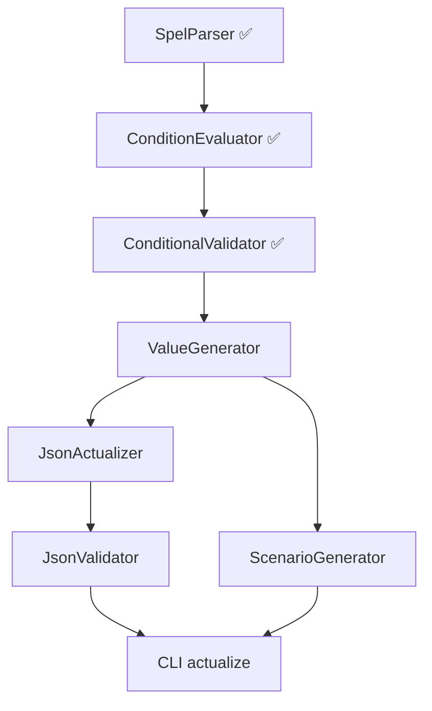

# TODO: json-scenario-generator

**Последнее обновление:** 2026-05-14  
**Прогресс MVP:** 75-80%  
**Тестов:** 281 passed (100%)  
**Релиз v0.1.0:** В работе  
**TD-7:** ✅ Исправлено (устаревшие ссылки в документации обновлены)

---

## 🎯 Критический путь MVP

```
ConditionEvaluator ✅ → ConditionalValidator ✅ → ValueGenerator (P0) → JsonActualizer (P0) → JsonValidator (P1) → CLI actualize (P1)
```

---

## ✅ Завершённые этапы (0-5)

| Этап | Компонент | Файлы | Тесты | Статус |
|------|-----------|-------|-------|--------|
| **Этап 0** | Подготовка | — | — | ✅ 100% |
| **Этап 1** | Базовая инфраструктура | `src/models/`, `src/utils/` | 35 | ✅ 100% |
| **Этап 2** | Парсеры и загрузчики | `SchemaParser`, `DictionaryLoader` | 15 | ✅ 100% |
| **Этап 2.5** | Анализаторы | `ChangeAnalyzer`, `SchemaComparator` | 24 | ✅ 100% |
| **Этап 3** | SpEL AST и Parser | `SpelAST`, `SpelParser` | 20 | ✅ 100% |
| **Этап 4** | SpEL Functions | `SpelFunctions` (34/34) | — | ✅ 100% |
| **Этап 5** | ConditionEvaluator + Validator | `ConditionEvaluator`, `ConditionalValidator` | 74 | ✅ 100% |

### Детали завершённых компонентов

**SpEL Engine:**
- 52 NodeType в AST
- 34 оператора парсинга
- 34 функции (Date API: 6, String API: 5, Бизнес: 4, Навигация: 5, Коллекции: 8, Логика: 6)

**Валидация:**
- `ConditionEvaluator` — 38 тестов, выполнение AST на JSON-данных
- `ConditionalValidator` — 36 тестов, УО-валидация

**Анализ изменений:**
- `ChangeAnalyzer` — 3-уровневая классификация (ChangeType + BreakingLevel + ImpactLevel)
- `ReportFormatter` — text/markdown/json отчёты

---

## 🔴 P0 — Критично для MVP (следующие 2 недели)

### Этап 6: ValueGenerator

**Файлы для создания:**
- `src/core/value_generator.py`
- `tests/unit/core/test_value_generator.py`

**Требования:**
- [x] Генерация значений для leaf-типов: string, integer, number, boolean, array (object — OUT OF SCOPE)
- [x] UUID-кэширование: external `Dict[str, str]` в `GeneratorConfig` (по `field_name`), stateless
- [x] Интеграция с Faker (два режима: готовый объект или создание из `locale`)
- [x] Форматирование: даты (`date`/`date-time`), ИНН 10/12 с КС ФНС, UUID, телефон (`7` + 10 цифр), СНИЛС (11 цифр без КС)
- [x] Поддержка справочников (DictionaryLoader)
- [x] Array-генерация: `max(minItems, default_array_size)` элементов, рекурсивно по `items`
- [x] Constraints: minLength, maxLength, minimum, maximum, pattern, enum
- [x] 34 unit-теста, покрытие 94%
- [ ] Placeholder-режим — отложено (нет бизнес-кейса)
- [ ] Object-рекурсия — отложено (обязанность JsonActualizer/ScenarioGenerator)

**Оценка:** 2 дня

---

### Этап 7: JsonActualizer

**Файлы для создания:**
- `src/core/json_actualizer.py`
- `tests/unit/core/test_json_actualizer.py`

**Требования:**
- [ ] Применение SchemaDiff к JSON
- [ ] Добавление новых полей (с генерацией значений через ValueGenerator)
- [ ] Удаление полей из JSON
- [ ] Преобразование типов полей
- [ ] Сохранение существующих значений
- [ ] 25+ unit-тестов

**Оценка:** 3 дня

---

### Этап 8: JsonValidator

**Файлы для создания:**
- `src/core/json_validator.py`
- `tests/unit/core/test_json_validator.py`

**Требования:**
- [ ] Двойная валидация: JSON Schema + SpEL
- [ ] Проверка обязательных (О) полей
- [ ] Проверка условно обязательных (УО) полей через ConditionEvaluator
- [ ] Детальный отчёт об ошибках валидации
- [ ] 35+ unit-тестов

**Оценка:** 2 дня

---

### Этап 9: CLI команды

**Файлы для создания:**
- `src/cli/__init__.py`
- `src/cli/commands/__init__.py`
- `src/cli/commands/actualize.py`
- `src/cli/commands/validate.py`
- `src/cli/commands/generate.py`
- `src/cli/ui/__init__.py` (Rich UI компоненты)

**Требования:**
- [ ] Команда `actualize` — актуализация JSON по diff
- [ ] Команда `validate` — валидация JSON по схеме + SpEL
- [ ] Команда `generate` — генерация сценариев
- [ ] Rich UI: прогресс-бары, цветной вывод
- [ ] Интеграция с ReportFormatter
- [ ] Интеграционные тесты

**Оценка:** 2 дня

---

## 🟡 P1 — MVP релиз (после P0)

### Этап 10: ScenarioGenerator

**Файлы для создания:**
- `src/core/scenario_generator.py`
- `tests/unit/core/test_scenario_generator.py`

**Требования:**
- [ ] Комбинаторика по 8 параметрам (productCd, creditProgramCd, loanTypeCd, channelCd, и т.д.)
- [ ] Интеграция с Лист 19 (Excel маппинг PRODUCTCD → CALLCD)
- [ ] Генерация min-сценариев (О + УО поля)
- [ ] Генерация max-сценариев (О + Н + УО поля)
- [ ] Кэширование общих значений
- [ ] 40+ unit-тестов

**Оценка:** 3 дня

---

## 🟢 P2 — Post-MVP (улучшения)

### Этап 11: SpelFormatter

**Приоритет:** P2 (Post-MVP)  
**Зависимости:** SpelParser (✅), SpelFunctions (✅), DictionaryLoader (✅)  
**Блокирует:** ReportGenerator (P2), улучшенные markdown-отчёты  
**Оценка:** 2-3 дня  
**Цель:** Преобразование сырых SpEL-выражений в отчётах в читаемый русский текст.

---

**Файлы:**
- `src/formatters/spel_formatter.py` — реализация форматтера
- `tests/unit/formatters/test_spel_formatter.py` — 15+ unit-тестов

**Контекст (почему это важно):**
В отчётах `ChangeAnalyzer` условно-обязательные (УО) поля выводятся сырыми SpEL-выражениями:
```
Условие: in(#this.productCdExt, 10410001, 10410002, 10410034)
```
Это нечитаемо для QA и бизнес-аналитиков. `SpelFormatter` превращает это в:
```
Условие: продукт = PACCREACT, PACLIREACT или CARDREACT
```

**Архитектурные варианты (требует обсуждения):**

| # | Подход | Строки | Плюсы | Минусы |
|---|--------|--------|-------|--------|
| 1 | **Registry (рекомендуется)** | ~200 | Декларативно, легко добавлять операторы | Для сложных вложенных and/or нужны хелперы |
| 2 | **Visitor Pattern** | ~500 | Строгая типизация, легко тестировать отдельные методы | Много boilerplate, менее идиоматичен для Python |
| 3 | **Template-based** | ~300 | i18n из коробки, шаблоны в YAML | Сложные вложенные выражения плохо ложатся |
| 4 | **Recursive Descent** | ~150 | Просто, естественно для AST | Трудно кастомизировать отдельные операторы |

**Ключевая проблема: вложенные условия**
```spel
and(
    notNull(#this.regionCd),
    in(#this.addressTypeCd, 10150001, 10150002)
)
```
→ Читаемый вывод:
```
regionCd не пустой
И (
    тип адреса = Регистрация или Фактический
)
```

**Требования (функциональные):**

| ID | Требование | Пример входа | Пример выхода |
|----|-----------|--------------|---------------|
| FR-SF-001 | Базовые операторы | `eq(status, "ACTIVE")` | `status = ACTIVE` |
| FR-SF-002 | Логические AND/OR | `and(eq(a,1), eq(b,2))` | `a = 1 И b = 2` |
| FR-SF-003 | Null-проверки | `notNull(#this.regionCd)` | `regionCd не пустой` |
| FR-SF-004 | IN с кодами | `in(productCdExt, 10410001, 10410002)` | `продукт = PACCREACT, PACLIREACT` |
| FR-SF-005 | Дата-операторы | `minusYears(currentDate(), 14)` | `текущая дата минус 14 лет` |
| FR-SF-006 | Вложенность | `and(eq(a,1), or(eq(b,2), eq(c,3)))` | многострочный с отступами |
| FR-SF-007 | Справочники | `in(productCdExt, 10410001)` | `продукт = PACCREACT` (через DictionaryLoader) |
| FR-SF-008 | 3 уровня детализации | SHORT / MEDIUM / DETAILED | `a=1` vs `a = 1` vs `Поле a равно 1` |

**Интеграция с DictionaryLoader:**
- `productCdExt` → справочник `PRODUCT_TYPE` → код `10410001` → имя `PACCREACT`
- Поле `field_name → dictionary` маппинг берётся из `FieldMetadata.dictionary`

**Тестовая стратегия:**
1. 5 тестов на базовые операторы (eq, in, and, or, notNull)
2. 3 теста на вложенность (2 уровня, 3 уровня, смешанные and/or)
3. 3 теста на справочники (mock DictionaryLoader)
4. 3 теста на уровни детализации (SHORT/MEDIUM/DETAILED)
5. 2 теста на edge cases (пустые выражения, unknown operator)

**Чек-лист реализации:**
- [ ] Выбрать архитектурный подход (registry/visitor/template/recursive)
- [ ] Написать `tests/unit/formatters/test_spel_formatter.py`
- [ ] Реализовать `src/formatters/spel_formatter.py`
- [ ] Покрытие > 85%
- [ ] Интеграция с `ReportFormatter.format_markdown()` (опционально)
- [ ] Обновить `CLAUDE.md`, `TODO.md`, `.planning/STATE.md`

**Риски:**
| # | Риск | Митигация |
|---|------|-----------|
| 1 | Сложные вложенные `and/or` → некорректные скобки | Тесты на 3+ уровня вложенности |
| 2 | DictionaryLoader медленный при частом резолвинге | Кэшировать `code → name` в SpelFormatter |
| 3 | Новые операторы в схемах (v75+) | Registry-подход позволяет добавить 1 строкой |

---

### ReportGenerator

**Файлы:**
- `src/reports/generator.py`
- `src/reports/templates/` (Markdown шаблоны)

**Требования:**
- [ ] Расширенные Markdown-отчёты для актуализации
- [ ] Отчёты для валидации
- [ ] Агрегация изменений по сценариям
- [ ] 15+ unit-тестов

**Оценка:** 2 дня

---

## 🛠️ Технический долг

### Высокий приоритет (🟠)

| # | Проблема | Файлы | Действие |
|---|----------|-------|----------|
| TD-7 | **Устаревшие ссылки в документации** | `docs/ARCHITECTURE.md`, `docs/PRD.md`, `CHANGELOG.md`, `TODO.md` | ✅ **ИСПРАВЛЕНО** (08.05.2026) |
| TD-8 | **Wrong JSON Schema Draft** | `src/utils/json_utils.py:11, 165` | ✅ **ИСПРАВЛЕНО** (Draft7 → Draft 2019-09, 11.05.2026) |

### Средний приоритет (🟡)

| # | Проблема | Действие |
|---|----------|----------|
| TD-9 | **No integration tests** | Создать `tests/integration/` с E2E тестами |
| TD-10 | **No test fixtures** | Создать `tests/fixtures/` с тестовыми данными |
| TD-11 | **Backup files в репо** | Удалить 6 `.backup` файлов |
| TD-12 | **Deprecated code в src/** | Переместить `src/deprecated/` за пределы `src/` или удалить |

---

## 📁 Структура файлов (актуальная)

### Ядро (src/core/)

```
src/core/
├── spel_ast.py              ✅ 52 NodeType
├── spel_parser.py           ✅ 34 оператора
├── spel_functions.py        ✅ 34/34 функции
├── condition_evaluator.py   ✅ 38 тестов
├── conditional_validator.py ✅ 36 тестов
├── schema_comparator.py     ✅
├── value_generator.py       🔴 TODO
├── json_actualizer.py       🔴 TODO
├── json_validator.py        🔴 TODO
└── scenario_generator.py    🟡 TODO
```

### Инфраструктура

```
src/
├── models/                  ✅ 11 dataclass + 4 enum
├── parsers/
│   └── schema_parser.py     ✅
├── loaders/
│   └── dictionary_loader.py ✅
├── analyzers/
│   └── change_analyzer.py   ✅
├── formatters/
│   └── report_formatter.py  ✅ text/markdown/json
├── utils/
│   ├── logger.py            ✅
│   ├── json_utils.py        ✅ Draft 2019-09
│   └── excel_utils.py       ✅
├── cli/                     🔴 Пусто
│   ├── commands/            🔴 Пусто
│   └── ui/                  🔴 Пусто
└── reports/                 🔴 Пусто
```

### Тесты

```
tests/
├── unit/
│   ├── test_*.py            ✅ 13 файлов, ~119 тестов
│   └── core/
│       ├── test_spel_parser.py          ✅ 20 тестов
│       ├── test_condition_evaluator.py  ✅ 38 тестов
│       └── test_conditional_validator.py ✅ 36 тестов
├── integration/             🔴 Пусто
└── fixtures/                🔴 Пусто
```

---

## 📊 Метрики проекта

| Метрика | Значение |
|---------|----------|
| **Файлов кода** | ~40 .py файлов |
| **Unit-тестов** | 247 passed |
| **Покрытие ядра** | ~85% (оценка) |
| **SpEL операторов** | 34/34 (100%) |
| **SpEL функций** | 34/34 (100%) |
| **Готовность MVP** | 75-80% |

---

## 🚦 Зависимости между задачами



---

## 📋 Анализ документов для ValueGenerator (2026-05-13)

> На основе анализа `front-adapter v.17.7.docx`, `Приложение_1_параметры_для_front_adapter_v_17_7.xlsx` и папки `data/scenarios/`.

### 1. Placeholder-ы в сценариях (Postman-артефакты) — OUT OF SCOPE
Рабочие JSON содержат шаблоны — это **артефакты Postman-коллекций**, использовались для рандомизации и обеспечения уникальности данных в рамках сквозной заявки (Call0 → CallN → CallResult).

- `{{number}}...` — UUID/идентификаторы (`loanRequestExtId`, `customerRequestExtId`, `pledgeExtId`)
- `{{randomDocNum}}` — номера документов (`docNum`, `valueNum`)
- `{{randomString}}` — произвольные строки (`thirdNm`)
- `{{errorId}}` — ID ошибок

**Решение:** Placeholder-режим отложен. Нет бизнес-кейса сейчас. Если понадобится — добавим в ScenarioGenerator или JsonActualizer.

### 2. UUID — кэширование между Call-ами обязательно
Идентификаторы заявки повторяются в разных JSON:
- `loanRequestExtId`, `customerRequestExtId`, `creditHistoryBureauExtId`
- `tessaAppDossierId`, `pledgeExtId`, `contentStoreDataExtId`
- **Механизм:** external `Dict[str, str]` в `GeneratorConfig.uuid_cache` (ключ = `field_name`). ValueGenerator stateless — читает/пишет в переданный dict. ScenarioGenerator создаёт один кэш на заявку и передаёт при каждом вызове.

### 3. Справочники — доминирующий тип данных
Большинство полей с суффиксом `CdExt` содержат числовые коды из справочников:
- `productCdExt = 10410032` (PRODUCT_TYPE)
- `channelCdExt = 10620009` (CHANNEL)
- `creditProgramCdExt = 10320007` (CREDIT_PROGRAM)
- `currencyCdExt = 10110118` (CURRENCY)
- `loanTypeCdExt = 10090001`
- `docTypeCdExt`, `docSubTypeCdExt`, `addressTypeCdExt`, `contactTypeCdExt`, `consentTypeCdExt`, `flagCdExt`

### 4. Специальные форматы (из реальных сценариев)
| Формат | Пример | Требование |
|--------|--------|------------|
| ИНН (10 цифр) | `7830112296` | Алгоритм ФНС с КС (`strict_inn=True`)
| ИНН (12 цифр) | `363424544165` | Юр. лицо / работодатель с КС |
| СНИЛС | `10300026` (8 цифр в JSON) | 11 цифр без КС — Java-валидатор не проверяет КС (`strict_snils=False`)
| Телефон | `79154758060` | 11 цифр, начинается с `7` (Java-валидатор не проверяет regex)
| Банк. счёт | `40816810800009847389` | 20 цифр |
| БИК | `442345678` | 9 цифр |
| Дата | `2020-05-26` | `YYYY-MM-DD` |
| Datetime | `2024-01-01T10:27:11.17` | ISO 8601 с миллисекундами |
| UUID | `3690ee8d-68a3-473c-ac58-802516011111` | Стандартный формат |

### 5. Типы данных из XLSX (лист «Типы данных»)
| Тип в сообщении | JSON Schema эквивалент | Формат |
|-----------------|-----------------------|--------|
| `string(36)` | `string` + `format: uuid` | UUID |
| `string(N<>36)` | `string` + `maxLength: N` | Обычная строка |
| `datetime` | `string` + `format: date-time` | `YYYY-MM-DDTHH:MM:SS.sss` |
| `date` | `string` + `format: date` | `YYYY-MM-DD` |
| `number(10,0)` | `integer` / `number` | Целочисленный код |
| `number(23,5)` | `number` | Суммы с 5 знаками после запятой |
| `number` | `number` / `integer` | Зависит от контекста |

### 6. Массивы и вложенные объекты
Обнаружено **15+ типов массивов**, каждый элемент — объект:
- `customerForms[]`, `documents[]`, `addresses[]`, `contacts[]`
- `customerFormIncomes[]`, `creditIssueIncomes[]`
- `creditParameters[]`, `pledges[]`, `employees[]`
- `consents[]`, `contentStoreData[]`, `liabilities[]`
- `selectedProducts[]`, `insurances[]`, `additionalOptions[]`, `creditIssuanceResults[]`

### 7. Битые JSON-сценарии
7 из 16 файлов содержат синтаксические ошибки (все `*_prospect_spouse_seller_org_appraiser.json` + `call6_prospect...`).
Вероятная причина: ручное копирование из Postman/блокнота.
Перед использованием в автотестах требуется валидация JSON.

### 8. Обязательность и версионирование
XLSX содержит колонки обязательности для **8 разных версий/каналов**:
- ВТБ-онлайн (сентябрь, ноябрь)
- УЗ (июль, сентябрь, октябрь, февраль, март)
- Ипотека (январь, февраль, март)
- Ипотека_нестандарты (август)

ValueGenerator должен принимать параметр **версии + канала** для фильтра полей.

---

## 📝 Чек-лист перед релизом v0.1.0

- [ ] ValueGenerator реализован и протестирован
- [ ] JsonActualizer реализован и протестирован
- [ ] JsonValidator реализован и протестирован
- [ ] CLI команды работают
- [ ] Все интеграционные тесты проходят
- [x] Технический долг TD-7, TD-8 исправлен
- [ ] Документация обновлена
- [ ] CHANGELOG.md актуализирован
- [ ] Все 247 существующих тестов проходят

---

## 🔗 Ссылки

- **Репозиторий:** https://github.com/Chemixx/json-scenario-generator
- **Спецификация:** `docs/SPECIFICATION.md` (~2700 строк)
- **Архитектура:** `docs/ARCHITECTURE.md`
- **Разработка:** `docs/DEVELOPMENT.md`
- **PRD:** `docs/PRD.md`
- **Состояние:** `.planning/STATE.md`
- **Roadmap:** `.planning/ROADMAP.md`
