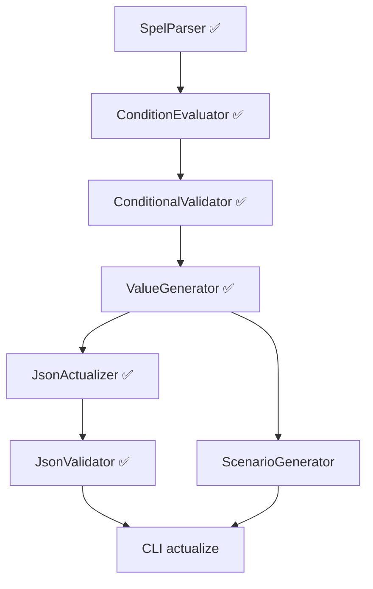

# TODO: json-scenario-generator

**Последнее обновление:** 2026-05-26
**Прогресс MVP:** ~92%
**Тестов:** 541 passed (100%)
**Релиз v0.1.0:** В работе
**TD-7:** ✅ Исправлено (устаревшие ссылки в документации обновлены)

---

## 🎯 Критический путь MVP

```
ConditionEvaluator ✅ → ConditionalValidator ✅ → ValueGenerator ✅ → JsonActualizer ✅ → JsonValidator ✅ → DictionaryLoader v2 ✅ → CLI actualize (P1)
```

---

## ✅ Завершённые этапы (0-5)

| Этап | Компонент | Файлы | Тесты | Статус |
|------|-----------|-------|-------|--------|
| **Этап 0** | Подготовка | — | — | ✅ 100% |
| **Этап 1** | Базовая инфраструктура | `src/models/`, `src/utils/` | 35 | ✅ 100% |
| **Этап 2** | Парсеры и загрузчики | `SchemaParser`, `DictionaryLoader` | 15 | ✅ 100% |
| **Этап 2.5** | Анализаторы | `ChangeAnalyzer`, `SchemaComparator` | 24 | ✅ 100% |
| **Этап 3** | SpEL AST и Parser | `SpelAST`, `SpelParser` | 20 | ✅ 100% |
| **Этап 4** | SpEL Functions | `SpelFunctions` (34/34) | — | ✅ 100% |
| **Этап 5** | ConditionEvaluator + Validator | `ConditionEvaluator`, `ConditionalValidator` | 74 | ✅ 100% |
| **Этап 6** | ValueGenerator | `ValueGenerator` | 34 | ✅ 100% |
| **Этап 7** | JsonActualizer | `JsonActualizer` | 104 | ✅ 100% |
| **Этап 8** | JsonValidator | `JsonValidator` | 85 | ✅ 100% |
| **DictLoader v2** | DictionaryRegistry + JsonDictLoader | `DictionaryRegistry`, `JsonDictionaryLoader` | 57 | ✅ 100% |

### Детали завершённых компонентов

**SpEL Engine:**
- 52 NodeType в AST
- 34 оператора парсинга
- 34 функции (Date API: 6, String API: 5, Бизнес: 4, Навигация: 5, Коллекции: 8, Логика: 6)

**Валидация:**
- `ConditionEvaluator` — 38 тестов, выполнение AST на JSON-данных
- `ConditionalValidator` — 36 тестов, УО-валидация

**Анализ изменений:**
- `ChangeAnalyzer` — 3-уровневая классификация (ChangeType + BreakingLevel + ImpactLevel)
- `ReportFormatter` — text/markdown/json отчёты

---

## ✅ Завершённые этапы (0-8 + DictLoader v2)

### Этап 6: ValueGenerator ✅

**Файлы:**
- `src/core/value_generator.py` ✅
- `tests/unit/core/test_value_generator.py` ✅ (34 теста, покрытие 94%)

**Реализовано:**
- [x] Генерация значений для leaf-типов: string, integer, number, boolean, array (object — OUT OF SCOPE)
- [x] UUID-кэширование: external `Dict[str, str]` в `GeneratorConfig` (по `field_name`), stateless
- [x] Интеграция с Faker (два режима: готовый объект или создание из `locale`)
- [x] Форматирование: даты (`date`/`date-time`), ИНН 10/12 с КС ФНС, UUID, телефон (`7` + 10 цифр), СНИЛС (11 цифр без КС)
- [x] Поддержка справочников (DictionaryLoader)
- [x] Array-генерация: `max(minItems, default_array_size)` элементов, рекурсивно по `items`
- [x] Constraints: minLength, maxLength, minimum, maximum, pattern, enum
- [x] 34 unit-теста, покрытие 94%
- [x] Seed-изоляция: собственный `random.Random()` для воспроизводимости
- [ ] Placeholder-режим — отложено (нет бизнес-кейса)
- [ ] Object-рекурсия — отложено (обязанность ScenarioGenerator)

**Оценка:** 2 дня ✅ завершено 2026-05-14

---

### Этап 7: JsonActualizer ✅

**Файлы:**
- `src/core/json_actualizer.py` ✅
- `tests/unit/core/test_json_actualizer.py` ✅ (104 теста, покрытие 100%)

**Реализовано:**
- [x] Применение SchemaDiff к JSON
- [x] Добавление новых полей (О/УО/Н) с генерацией через ValueGenerator
- [x] Удаление полей из JSON
- [x] Модификация полей: сохранение/перегенерация/преобразование типов
- [x] Обнаружение переименований (эвристика ≥3/5 атрибутов + field_mapping)
- [x] 3 уровня отката: field/full/none (ADR-4, ADR-6)
- [x] Изоляция модуля: actualize() не бросает исключения наружу (ADR-6)
- [x] `ActualizerConfig`, `ActualizationChange`, `ActualizationResult`, `RenamePair`
- [x] `_validate_value()` — проверка типа, enum, pattern, длины, диапазона (ADR-2)
- [x] `_transform_value()` — преобразование типов (int↔string, bool↔string)
- [x] `to_markdown()` — Markdown-отчёт

**Технический долг (TD-13..TD-15):**
- ✅ **TD-13**: ~~`_evaluate_condition()` использует `ConditionEvaluator` напрямую~~ — **ИСПРАВЛЕНО** (24.05.2026): делегировано `ConditionalValidator._build_context()`, добавлен параметр `field_path`, 4 теста без моков
- ✅ **TD-14**: ~~Покрытие 70% вместо целевых 90%~~ — **ИСПРАВЛЕНО** (24.05.2026): 104 теста (было 43), покрытие 100% (было 71%). Строка 971 помечена `# pragma: no cover` (мёртвый код — недостижимая ветка elif).
- ⚠️ **TD-15**: ~~`__import__('re')` в `_validate_value()`~~ — ✅ исправлено: _validate_value теперь использует constraint_utils

**Оценка:** 3 дня ✅ завершено 2026-05-17

---

## 🔴 P0 — Критично для MVP

---

### Этап 8: JsonValidator ✅

**Файлы:**
- `src/core/json_validator.py` ✅
- `src/utils/constraint_utils.py` ✅
- `tests/unit/core/test_json_validator.py` ✅ (59 тестов)
- `tests/unit/test_constraint_utils.py` ✅ (26 тестов)

**Реализовано:**
- [x] 5 шагов валидации: schema (Draft201909Validator), required (О), conditional (УО), constraints, dictionaries
- [x] ValidatorConfig: конфигурация шагов, strict/lenient, DQ-коды, формат вывода
- [x] Иерархия ошибок: BaseValidationError + SchemaError, RequiredError, ConditionalError, ConstraintError, DictionaryError
- [x] ValidationResult с to_summary (tree/flat) и to_dict
- [x] validate_batch() и validate_from_paths() с автодетектом call из stageName/version/direction
- [x] constraint_utils.py: 10 общих функций проверок ограничений
- [x] DQ-коды: парсинг 3 полей в SchemaParser, проброс в ошибки валидации
- [x] requirement_type (null/missing) в ConditionalValidator.ValidationError
- [x] Рефакторинг JsonActualizer: _validate_result удалён, _validate_value использует constraint_utils

**Оценка:** 2 дня ✅ завершено 2026-05-22

---

### DictionaryLoader v2 ✅

**Файлы:**
- `src/loaders/dictionary_registry.py` ✅
- `src/loaders/json_dictionary_loader.py` ✅
- `tests/unit/test_dictionary_registry.py` ✅
- `tests/unit/test_json_dictionary_loader.py` ✅
- `tests/unit/test_spel_dictionary_integration.py` ✅
- `tests/integration/test_dictionary_pipeline.py` ✅
- `tests/fixtures/dictionaries/sample.json` ✅

**Реализовано:**
- [x] `DictionaryEntry` extended: english_localization, current_version, is_deleted, attributes, mappings
- [x] `Dictionary` O(1) hash indexes (_code_index, _name_index)
- [x] `DictionaryMetadata` — dataclass for prod-JSON dictionary metadata
- [x] `ResolveResult` — dataclass for code resolution with flexible formatting
- [x] `DictionaryRegistry` — central store with O(1) lookup, resolve, validation, load_from_json, load_from_excel
- [x] `JsonDictionaryLoader` — loads prod-JSON format (1905.64/1905.65) with filter_deleted/filter_current
- [x] Real `SpelFunctions.is_dictionary_value()` via Registry (replaces stub)
- [x] ValueGenerator/JsonValidator/ReportFormatter — registry integration with fallback
- [x] DictionaryLoader bug fix: code column type int instead of str
- [x] Integration tests: full pipeline JSON→Registry→SpEL→Validation

**Обратная совместимость:**
- Все новые поля имеют defaults
- SpelFunctions без Registry — fallback к True (stub behavior)
- ValueGenerator/JsonValidator без Registry — fallback к DictionaryLoader

**Оценка:** 2 дня ✅ завершено 2026-05-26

---

### Этап 9: CLI команды

**Файлы для создания:**
- `src/cli/__init__.py`
- `src/cli/commands/__init__.py`
- `src/cli/commands/actualize.py`
- `src/cli/commands/validate.py`
- `src/cli/commands/generate.py`
- `src/cli/ui/__init__.py` (Rich UI компоненты)

**Требования:**
- [ ] Команда `actualize` — актуализация JSON по diff
- [ ] Команда `validate` — валидация JSON по схеме + SpEL
- [ ] Команда `generate` — генерация сценариев
- [ ] Rich UI: прогресс-бары, цветной вывод
- [ ] Интеграция с ReportFormatter
- [ ] Интеграционные тесты

**Оценка:** 2 дня

---

## 🟡 P1 — MVP релиз (после P0)

### Этап 10: ScenarioGenerator

**Файлы для создания:**
- `src/core/scenario_generator.py`
- `tests/unit/core/test_scenario_generator.py`

**Требования:**
- [ ] Комбинаторика по 8 параметрам (productCd, creditProgramCd, loanTypeCd, channelCd, и т.д.)
- [ ] Интеграция с Лист 19 (Excel маппинг PRODUCTCD → CALLCD)
- [ ] Генерация min-сценариев (О + УО поля)
- [ ] Генерация max-сценариев (О + Н + УО поля)
- [ ] Кэширование общих значений
- [ ] 40+ unit-тестов

**Оценка:** 3 дня

---

## 🟠 Технический долг (детали)

### TD-16: ~~Emoji в runtime-коде ломают Windows-консоль~~ ✅ Исправлено

**Решение (Вариант D):** Комбинация A+B+централизация.

- Создан `src/utils/icons.py` с классом `Icon` — 31 ASCII-константа, cp1251-safe
- Добавлены `to_icon()` методы в `BreakingLevel` и `ImpactLevel`
- `format_text()` использует Icon-константы, `format_markdown()` сохраняет эмодзи
- `logger.py` заменены эмодзи на Icon + добавлен `sys.stdout.reconfigure(encoding='utf-8', errors='replace')`
- 160 эмодзи в runtime-коде заменены на ASCII-аналоги
- Все 423 теста пройдут, 100% cp1251-совместимость

**Коммиты:**
- `3381ced` feat(utils): add Icon module with ASCII-safe console markers
- `91e2011` feat(models): add to_icon() methods to BreakingLevel and ImpactLevel
- `9aa1a8e` feat: replace emoji with ASCII Icons in all runtime source files
- `030a898` feat(scripts): replace emoji with Icon + add encoding safety net in CLI
- `99ebc4a` test: update test assertions from emoji to ASCII Icon constants
- `e210ed3` fix: replace remaining emoji in logger example and spel_functions docstring

### TD-17: Loguru логи смешаны с отчётом в STDOUT

**Проблема:** При запуске `analyze_changes.py` (и любого CLI-скрипта) в STDOUT
попадают INFO/DEBUG логи loguru — 20+ строк перед полезным выводом отчёта.
Пользователю сложно найти результат среди логов.

**Пример (реальный вывод):**
```
2026-05-19 | INFO | src.utils.logger:setup_logger:52 - ================= ...
2026-05-19 | INFO | src.utils.logger:setup_logger:53 - 🚀 JSON Scenario ...
2026-05-19 | INFO | src.utils.logger:setup_logger:54 - 📂 Логи сохраняются ...
2026-05-19 | INFO | src.utils.logger:setup_logger:55 - 📊 Уровень: DEBUG
... 15+ строк логов ...
2026-05-19 | INFO | src.core.schema_comparator:compare:87 - 🔄 Сравнение ...
================================================================================
📊 ОТЧЕТ ОБ ИЗМЕНЕНИЯХ JSON SCHEMA   ← ← ПОЛЕЗНЫЙ ВЫВОД НАЧИНАЕТСЯ ЗДЕСЬ
```

**Варианты решения:**

| # | Подход | Описание |
|---|--------|----------|
| A | CLI → WARNING, скрипты → DEBUG | Добавить параметр `--log-level` в CLI. По умолчанию WARNING для CLI-команд, DEBUG для `--verbose` |
| B | Логи только в файл | loguru пишет только в `logs/app.log`, STDOUT — только для отчётов |
| C | Разные handlers для CLI | CLI handler: WARNING+ в STDERR, INFO+ в файл; API handler: DEBUG в оба |

**Рекомендация:** Вариант A+B: CLI-scripts по умолчанию пишут WARNING в STDERR и INFO в файл.
Отчётный вывод (ReportFormatter) — только в STDOUT. При `--verbose` — DEBUG в STDERR.

**Приоритет:** 🟡 Средний. Решить при реализации Этапа 9 (CLI).

### TD-18: `affected_scenarios` всегда пустой

**Проблема:** В отчёте `ChangeAnalyzer` поле `affected_scenarios` у каждого
`AnalyzedChange` всегда `[]` (пустой список). Из 18 изменений — 18 с пустым списком.
Это создаёт впечатление, что инструмент не доработан — поле обещает конкретику,
но никогда не заполняется.

**Вопрос для анализа:** Что должно содержать это поле?
- Список сценариев (productCdExt), на которые влияет изменение?
- Ссылки на конкретные JSON-файлы сценариев?
- Коды продуктов, при которых поле становится обязательным?

Пока не ясно, нужно провести анализ бизнес-требований. Возможные варианты:
- Убрать поле, если нет источника данных для заполнения
- Заполнять из SpEL-условия (извлекать productCdExt из `in(productCdExt, ...)`)
- Заполнять из DictionaryLoader (маппинг кодов продуктов)

**Приоритет:** 🟡 Средний. Нужен анализ перед реализацией.

### TD-19: Шаблонные рекомендации в отчёте

**Проблема:** 30 из 51 рекомендаций в отчёте — универсальные шаблоны:
«Проверить условие», «Обновить сценарии», «Добавить поле в сценарии».
Это не помогает пользователю — он и так знает, что нужно проверить.
Полезнее были бы конкретные данные.

**Пример текущего вывода:**
```
Рекомендации:
  ✓ Проверить условие: in(productCdExt, 10410001, 10410002, 10410005)
  ✓ Добавить поле 'loanRequest/onlinePaOffer/approvedCreditAmt' в сценарии
  ✓ Запросы без поля будут отклонены, если условие выполняется
```

**Что было бы полезнее:**
- Конкретные сценарии (productCdExt), затронутые изменением
- Какие именно поля нужно добавить и в какие разделы JSON
- Автоматическая генерация минимального diff-патча

**Зависимость:** Частично пересекается с TD-18 (affected_scenarios).
**Приоритет:** 🔵 Низкий. Анализ + улучшение в P2.

### TD-20: Обрезанные SpEL-условия в отчёте

**Проблема:** В отчёте `ReportFormatter` обрезает длинные SpEL-условия:
```
anyMatch(#rootBean.loanRequest.creditParameters, in(productCdExt, 10410020, 10410021, 10410077, 1041...
```
Список значений productCdExt — **самая важная информация** для QA.
Обрезание лишает пользователя возможности понять, какие продукты затронуты.

**Место в коде:** `src/formatters/report_formatter.py` — форматирование
`condition_expression` и `reason` в текстовом/JSON-формате.

**Варианты решения:**
- Не обрезать: показывать полный список значений (может быть длинным)
- Показывать ключевые значения + «и ещё N» в конце
- Использовать многострочный формат для длинных условий

**Приоритет:** 🟠 Средний-высокий. Ложит критически важную информацию.

### TD-21: Exit code 0 при breaking changes

**Проблема:** `analyze_changes.py` возвращает exit code 0, даже когда
15 breaking changes. Скрипт проверяет `result.has_critical_changes()`,
но критичность (critical) ≠ ломающий изменение (breaking).

**Текущая логика:**
```python
if result.has_critical_changes():
    sys.exit(1)  # только если impact_level == "critical"
else:
    sys.exit(0)  # 15 breaking, 0 critical → exit 0
```

**Вопрос для анализа:** Какой exit code должен быть при breaking changes?
- `0` — нет критических изменений (текущее поведение)
- `1` — есть breaking changes (предложение)
- `2` — есть критические изменения, `1` — breaking без критических

CI/CD-пайплайны обычно проверяют `exit code != 0`, поэтому breaking changes
должны давать ненулевой код. Но нужен анализ, не сломает ли это
существующие скрипты.

**Приоритет:** 🔵 Низкий. Нужен анализ перед изменением.

---

### TD-9: Нет интеграционных тестов

**Проблема:** `tests/integration/` частично заполнен (dictionary pipeline ✅). Существующие 541 unit-тест проверяют каждый
модуль изолированно, но баги на стыках компонентов не ловятся. Например, TD-13
(УО-поля в JsonActualizer) — именно проблема стыка JsonActualizer ↔ ConditionEvaluator.

**Принцип:** Интеграционные тесты используют реальные компоненты (без моков),
мокируя только I/O (чтение файлов, DictionaryLoader). Это позволяет ловить баги
на границах модулей — несоответствие контрактов, потерю данных при передаче,
ошибки в SpEL-выражениях из реальных схем.

**Зависимость:** Требует TD-10 (тестовые фикстуры).

**Приоритет:** 🟡 Средний. Ввести до Этапа 9 (CLI) — ловит регрессии при разработке CLI.

#### Подзадачи TD-9

##### TD-9.1: SchemaParser → ConditionalValidator

**Файл:** `tests/integration/test_parser_validator_integration.py`

**Стык:** Парсинг JSON Schema → извлечение УО-полей с SpEL-условиями →
валидация этих условий на реальных JSON-данных.

**Тесты (3-4):**

| Тест | Что проверяет |
|------|---------------|
| `test_parse_and_validate_conditional_required` | SchemaParser парсит `conditionalRequirement` → ConditionalValidator корректно валидирует УО-поля, когда SpEL-условие true (поле обязательно) |
| `test_parse_and_validate_conditional_false` | УО-поле не обязательно, когда SpEL-условие false. Парсер и эвалюатор работают согласованно — условие из схемы корректно вычисляется на данных |
| `test_parse_nested_spel_conditions` | Вложенные условия `and(notNull(...), in(...))` — парсер разбирает AST, эвалюатор корректно выполняет на данных. Именно такой тип бага был в TD-13 |
| `test_parse_field_paths_match_json` | Пути полей из схемы (`loanRequest/creditAmt`) совпадают с ключами в JSON. Проверяет, что SchemaParser и ConditionalValidator используют одну и ту же навигацию по путям |

**Почему отдельно:** Это самый частый источник багов — парсер создаёт одну модель,
а эвалюатор ожидает другую. Именно здесь был TD-13 (контекст для SpEL не собирался
правильно из распарсенных полей).

---

##### TD-9.2: ValueGenerator → JsonActualizer

**Файл:** `tests/integration/test_generator_actualizer_integration.py`

**Стык:** ValueGenerator генерирует значения для новых полей → JsonActualizer
подставляет их в JSON. Проверяет, что сгенерированные значения соответствуют
типам и constraints из схемы.

**Тесты (3-4):**

| Тест | Что проверяет |
|------|---------------|
| `test_actualize_with_value_generation` | Новые поля (О/УО/Н) добавляются со сгенерированными значениями. Типы значений совпадают с `field_type` из FieldMetadata (string, integer, number, boolean) |
| `test_uuid_cache_across_fields` | UUID-кэш: `loanRequestExtId` один и тот же при повторной актуализации. GeneratorConfig.uuid_cache корректно пробрасывается между вызовами ValueGenerator |
| `test_actualize_with_dictionary_values` | Справочник: сгенерированный `productCdExt` ∈ dictionary values. Проверяет интеграцию ValueGenerator ↔ DictionaryLoader |
| `test_actualize_preserves_constraints` | Сгенерированные значения удовлетворяют constraints: `pattern`, `minLength`, `maxLength`, `minimum`, `maximum`, `enum`. Без этой проверки actualizer может создать невалидный JSON |

**Почему отдельно:** ValueGenerator — единственный модуль с nondeterministic output.
Нужен seed-based testing (`GeneratorConfig(seed=...)`) для воспроизводимости.
Без этого стыка возможны ситуации, когда генератор создаёт значение, которое
actualizer подставляет, но validator отклоняет.

---

##### TD-9.3: JsonActualizer → JsonValidator

**Файл:** `tests/integration/test_actualizer_validator_integration.py`

**Стык:** JsonActualizer создаёт actualized JSON → JsonValidator проверяет его.
Проверяет, что результат актуализации проходит все 5 шагов валидации:
schema, required, conditional, constraints, dictionaries.

**Зависимость:** Требует завершения TD-9.2 (нужен рабочий actualization).

**Тесты (3-4):**

| Тест | Что проверяет |
|------|---------------|
| `test_actualize_then_validate_happy_path` | Actualized JSON проходит все 5 шагов валидации без ошибок. Happy path: обязательные поля на месте, УО-поля корректны, constraints соблюдены |
| `test_actualize_conditional_fields_validated` | УО-поля, добавленные actualizer'ом при условии true, валидируются как обязательные. При условии false — поле отсутствует и не вызывает RequiredError |
| `test_actualize_modified_fields_satisfy_constraints` | Modified поля после актуализации (перегенерация, преобразование типов) проходят constraint-проверки validator'а |
| `test_full_actualization_pipeline` | SchemaDiff → Actualize → Validate: end-to-end без моков (кроме DictionaryLoader). Полный цикл актуализации + валидации на реальных данных из фикстур |

**Почему отдельно:** Самый критичный стык — именно здесь проявлялся TD-13.
Actualizer и Validator написаны независимо, их контракты должны сходиться:
actualizer должен создавать JSON, который validator принимает.

---

##### TD-9.4: Полный пайплайн анализа

**Файл:** `tests/integration/test_analysis_pipeline_integration.py`

**Стык:** SchemaParser → SchemaComparator → ChangeAnalyzer → ReportFormatter.
Данные проходят через 4 модуля без моков — проверяет, что информация
не теряется на границах между этапами.

**Тесты (2-3):**

| Тест | Что проверяет |
|------|---------------|
| `test_full_analysis_pipeline_text` | Две схемы → parse → compare → analyze → format(text). Проверяет: поля не теряются, типы изменений корректны, отчёт содержит все изменения |
| `test_full_analysis_pipeline_markdown` | То же, формат markdown. Проверяет, что markdown-форматирование не ломает данные |
| `test_breaking_changes_detected` | Breaking changes корректно классифицируются через весь пайплайн. Удалённое обязательное поле → BreakingLevel.HIGH, изменённый тип → BreakingLevel.MEDIUM |

**Почему отдельно:** Анализ изменений — отдельная подсистема (не зависит от
actualization/validator). Пайплайн из 4 модулей подряд — типичное место для
потери данных при передаче (например, SchemaComparator создаёт SchemaDiff,
а ChangeAnalyzer не все поля из него читает).

---

##### График зависимостей

```
TD-10 (фикстуры) ──── обязательная предпосылка
  │
  ├── TD-9.1 (Parser → Validator) ──────┐
  │                                      ├── независимы друг от друга
  ├── TD-9.2 (Generator → Actualizer) ──┤
  │                                      │
  │   └── TD-9.3 (Actualizer → Validator) ← зависит от TD-9.2
  │                                      │
  └── TD-9.4 (Пайплайн анализа) ────────┘
```

TD-9.1, TD-9.2, TD-9.4 можно выполнять **параллельно**.
TD-9.3 требует завершения TD-9.2.

---

### TD-10: Нет тестовых фикстур

**Проблема:** `tests/fixtures/` содержит только `__init__.py`. Интеграционные и E2E-тесты
требуют готовых тестовых данных: схемы, JSON-сценарии, справочники. Сейчас каждый
тест создаёт данные вручную — дублирование и хрупкость.

**Рекомендация:** Создать минимальные фикстуры с нуля (урезанные схемы на 15-20 полей).
Полные схемы из `data/` использовать для E2E-тестов (TD-22).

**Приоритет:** 🟡 Средний. Предпосылка для TD-9 и TD-22.

#### Подзадачи TD-10

##### TD-10.1: Минимальные JSON Schema фикстуры

**Файлы:**
- `tests/fixtures/schemas/v070_minimal.json` — схема V070 (~15-20 полей)
- `tests/fixtures/schemas/v072_minimal.json` — схема V072 (diff от v070)

**Требования к v070_minimal.json:**
- Поля всех типов обязательности: О (alwaysRequired), УО (conditionalRequirement), Н (опциональные)
- УО-поля с SpEL-условиями: простые (`notNull(#this.regionCd)`) и вложенные (`and(notNull(...), in(...))`)
- Constraints: `pattern`, `minLength`, `maxLength`, `minimum`, `maximum`, `enum`
- Справочник: хотя бы одно поле с `dictionary: "PRODUCT_TYPE"`
- Форматы: `date`, `date-time`, `uuid`
- Массивы: хотя бы одно поле типа `array` с `items`

**Требования к v072_minimal.json (diff от v070):**
- +3 новых поля (О, УО, Н)
- -1 удалённое поле
- 2 modified поля (изменён тип, изменён constraint)
- 1 переименование (для тестирования detect_renames)

**Критерий готовности:** SchemaParser корректно парсит обе схемы без ошибок.

---

##### TD-10.2: Справочники и сценарии

**Файлы:**
- `tests/fixtures/dictionaries/product_types.json` — справочник PRODUCT_TYPE (5-10 записей)
- `tests/fixtures/dictionaries/channel.json` — справочник CHANNEL (3-5 записей)
- `tests/fixtures/scenarios/call1_valid.json` — минимальный валидный JSON по v070

**Требования:**
- `product_types.json`: записи с кодами из УО-условий в v070_minimal (например, `10410001`, `10410002`)
- `channel.json`: записи с кодами из схемы (например, `10620009`)
- `call1_valid.json`: корректный JSON, содержащий все обязательные поля v070 и данные,
  удовлетворяющие УО-условиям. Минимальный набор — `loanRequest` с 5-7 полями

**Критерий готовности:** DictionaryLoader загружает справочники, JSON валиден по схеме v070.

---

##### TD-10.3: Integration conftest.py

**Файл:** `tests/integration/conftest.py`

**Что создаётся:**
- `schema_v070()` — загружает `v070_minimal.json`, возвращает `Dict[str, FieldMetadata]`
- `schema_v072()` — загружает `v072_minimal.json`, возвращает `Dict[str, FieldMetadata]`
- `dict_loader()` — DictionaryLoader с загруженными справочниками из фикстур
- `call1_json()` — загружает `call1_valid.json`, возвращает `Dict[str, Any]`
- `parsed_fields_v070()` — результат `SchemaParser.parse()` на v070
- `parsed_fields_v072()` — результат `SchemaParser.parse()` на v072
- `schema_diff()` — результат `SchemaComparator.compare(v070, v072)`

**Критерий готовности:** Все фикстуры загружаются без ошибок, тесты могут импортировать
и использовать их напрямую через `@pytest.fixture`.

---

### TD-22: Нет E2E тестов

**Проблема:** Нет тестов полного пайплайна «от входа до выхода». Unit-тесты
проверяют модули, интеграционные — стыки, но никто не проверяет, что вся цепочка
SchemaParser → SchemaComparator → ChangeAnalyzer → JsonActualizer → JsonValidator
работает корректно на реальных данных.

**Что нужно покрыть:**

| # | Сценарий | Вход | Ожидаемый выход |
|---|----------|------|-----------------|
| 1 | Актуализация JSON | v070 schema + v072 schema + call1_valid.json | actualized JSON + 0 ошибок валидации |
| 2 | Валидация корректного JSON | v072 schema + call1_valid.json | ValidationResult: 0 errors |
| 3 | Валидация некорректного JSON | v072 schema + json с missing required fields | ValidationResult: RequiredError + ConditionalError |
| 4 | Полный пайплайн через CLI | CLI args (`actualize --schema-old ... --schema-new ... --input ...`) | exit code 0 + actualized JSON файл |
| 5 | Breaking changes detection | v070 schema + v072 schema | AnalyzedChange с BreakingLevel.HIGH |

**Когда вводить:** После Этапа 9 (CLI). E2E-тесты логично писать через
CLI-команды — это и есть точка входа пользователя. Без CLI — E2E через
программный вызов `actualize()` + `validate()`, но тогда придётся переписывать
при появлении CLI.

**Зависимости:** TD-10 (фикстуры) + Этап 9 (CLI для сценариев 4-5).

**Приоритет:** 🟡 Средний. Начать с программных E2E (сценарии 1-3) вместе с TD-9,
CLI-E2E (сценарии 4-5) — после Этапа 9.

---

## 🟢 P2 — Post-MVP (улучшения)

### Этап 11: SpelFormatter

**Приоритет:** P2 (Post-MVP)  
**Зависимости:** SpelParser (✅), SpelFunctions (✅), DictionaryLoader (✅), DictionaryRegistry (✅)  
**Блокирует:** ReportGenerator (P2), улучшенные markdown-отчёты  
**Оценка:** 2-3 дня  
**Цель:** Преобразование сырых SpEL-выражений в отчётах в читаемый русский текст.

---

**Файлы:**
- `src/formatters/spel_formatter.py` — реализация форматтера
- `tests/unit/formatters/test_spel_formatter.py` — 15+ unit-тестов

**Контекст (почему это важно):**
В отчётах `ChangeAnalyzer` условно-обязательные (УО) поля выводятся сырыми SpEL-выражениями:
```
Условие: in(#this.productCdExt, 10410001, 10410002, 10410034)
```
Это нечитаемо для QA и бизнес-аналитиков. `SpelFormatter` превращает это в:
```
Условие: продукт = PACCREACT, PACLIREACT или CARDREACT
```

**Архитектурные варианты (требует обсуждения):**

| # | Подход | Строки | Плюсы | Минусы |
|---|--------|--------|-------|--------|
| 1 | **Registry (рекомендуется)** | ~200 | Декларативно, легко добавлять операторы | Для сложных вложенных and/or нужны хелперы |
| 2 | **Visitor Pattern** | ~500 | Строгая типизация, легко тестировать отдельные методы | Много boilerplate, менее идиоматичен для Python |
| 3 | **Template-based** | ~300 | i18n из коробки, шаблоны в YAML | Сложные вложенные выражения плохо ложатся |
| 4 | **Recursive Descent** | ~150 | Просто, естественно для AST | Трудно кастомизировать отдельные операторы |

**Ключевая проблема: вложенные условия**
```spel
and(
    notNull(#this.regionCd),
    in(#this.addressTypeCd, 10150001, 10150002)
)
```
→ Читаемый вывод:
```
regionCd не пустой
И (
    тип адреса = Регистрация или Фактический
)
```

**Требования (функциональные):**

| ID | Требование | Пример входа | Пример выхода |
|----|-----------|--------------|---------------|
| FR-SF-001 | Базовые операторы | `eq(status, "ACTIVE")` | `status = ACTIVE` |
| FR-SF-002 | Логические AND/OR | `and(eq(a,1), eq(b,2))` | `a = 1 И b = 2` |
| FR-SF-003 | Null-проверки | `notNull(#this.regionCd)` | `regionCd не пустой` |
| FR-SF-004 | IN с кодами | `in(productCdExt, 10410001, 10410002)` | `продукт = PACCREACT, PACLIREACT` |
| FR-SF-005 | Дата-операторы | `minusYears(currentDate(), 14)` | `текущая дата минус 14 лет` |
| FR-SF-006 | Вложенность | `and(eq(a,1), or(eq(b,2), eq(c,3)))` | многострочный с отступами |
| FR-SF-007 | Справочники | `in(productCdExt, 10410001)` | `продукт = PACCREACT` (через DictionaryLoader) |
| FR-SF-008 | 3 уровня детализации | SHORT / MEDIUM / DETAILED | `a=1` vs `a = 1` vs `Поле a равно 1` |

**Интеграция с DictionaryLoader/Registry:**
- `productCdExt` → справочник `PRODUCT_TYPE` → код `10410001` → имя `PACCREACT`
- Поле `field_name → dictionary` маппинг берётся из `FieldMetadata.dictionary`
- Registry (DictionaryLoader v2) обеспечивает O(1) резолвинг код→имя

**Тестовая стратегия:**
1. 5 тестов на базовые операторы (eq, in, and, or, notNull)
2. 3 теста на вложенность (2 уровня, 3 уровня, смешанные and/or)
3. 3 теста на справочники (mock DictionaryLoader)
4. 3 теста на уровни детализации (SHORT/MEDIUM/DETAILED)
5. 2 теста на edge cases (пустые выражения, unknown operator)

**Чек-лист реализации:**
- [ ] Выбрать архитектурный подход (registry/visitor/template/recursive)
- [ ] Написать `tests/unit/formatters/test_spel_formatter.py`
- [ ] Реализовать `src/formatters/spel_formatter.py`
- [ ] Покрытие > 85%
- [ ] Интеграция с `ReportFormatter.format_markdown()` (опционально)
- [ ] Обновить `CLAUDE.md`, `TODO.md`, `.planning/STATE.md`

**Риски:**
| # | Риск | Митигация |
|---|------|-----------|
| 1 | Сложные вложенные `and/or` → некорректные скобки | Тесты на 3+ уровня вложенности |
| 2 | DictionaryLoader медленный при частом резолвинге | Кэшировать `code → name` в SpelFormatter |
| 3 | Новые операторы в схемах (v75+) | Registry-подход позволяет добавить 1 строкой |

---

### ReportGenerator

**Файлы:**
- `src/reports/generator.py`
- `src/reports/templates/` (Markdown шаблоны)

**Требования:**
- [ ] Расширенные Markdown-отчёты для актуализации
- [ ] Отчёты для валидации
- [ ] Агрегация изменений по сценариям
- [ ] 15+ unit-тестов

**Оценка:** 2 дня

---

## 🛠️ Технический долг

### Высокий приоритет (🟠)

| # | Проблема | Файлы | Действие |
|---|----------|-------|----------|
| TD-7 | **Устаревшие ссылки в документации** | `docs/ARCHITECTURE.md`, `docs/PRD.md`, `CHANGELOG.md`, `TODO.md` | ✅ **ИСПРАВЛЕНО** (08.05.2026) |
| TD-8 | **Wrong JSON Schema Draft** | `src/utils/json_utils.py:11, 165` | ✅ **ИСПРАВЛЕНО** (Draft7 → Draft 2019-09, 11.05.2026) |

### Средний приоритет (🟡)

| # | Проблема | Действие |
|---|----------|----------|
| TD-9 | **Нет интеграционных тестов** | Создать `tests/integration/` с тестами на 4 стыка (TD-9.1–TD-9.4, см. детали ниже) |
| TD-10 | **Нет тестовых фикстур** | Создать `tests/fixtures/` со схемами, справочниками, сценариями (TD-10.1–TD-10.3, см. детали ниже) |
| TD-22 | **Нет E2E тестов** | Создать 5 E2E-сценариев: актуализация, валидация, полный пайплайн через CLI (см. детали ниже) |
| TD-11 | **Backup files в репо** | ✅ Удалены 6 `.backup` файлов (19.05.2026) |
| TD-12 | **Deprecated code в src/** | Переместить `src/deprecated/` за пределы `src/` или удалить |
| TD-13 | **JsonActualizer: SpEL-контекст для УО-полей** | ✅ **ИСПРАВЛЕНО** (24.05.2026): делегировано `ConditionalValidator._build_context()`, 4 теста |
| TD-14 | **JsonActualizer: покрытие 70% вместо 90%** | ✅ **ИСПРАВЛЕНО** (24.05.2026): 104 теста, покрытие 100% |
| TD-15 | **JsonActualizer: `__import__('re')` в `_validate_value`** | Заменить на явный `import re` в начале файла |

---

## 📁 Структура файлов (актуальная)

### Ядро (src/core/)

```
src/core/
├── spel_ast.py              ✅ 52 NodeType
├── spel_parser.py           ✅ 34 оператора
├── spel_functions.py        ✅ 34/34 функции
├── condition_evaluator.py   ✅ 38 тестов
├── conditional_validator.py ✅ 36 тестов
├── schema_comparator.py     ✅
├── value_generator.py       ✅ 34 теста, 94%
├── json_actualizer.py       ✅
├── json_validator.py        ✅ Done
└── scenario_generator.py    🟡 TODO
```

### Инфраструктура

```
src/
├── models/                  ✅ 11 dataclass + 4 enum
├── parsers/
│   └── schema_parser.py     ✅
├── loaders/
│   ├── dictionary_loader.py      ✅
│   ├── dictionary_registry.py     ✅ O(1) lookup, resolve, validation
│   └── json_dictionary_loader.py ✅ prod-JSON format
├── analyzers/
│   └── change_analyzer.py   ✅
├── formatters/
│   └── report_formatter.py  ✅ text/markdown/json
├── utils/
│   ├── logger.py            ✅
│   ├── json_utils.py        ✅ Draft 2019-09
│   └── excel_utils.py       ✅
├── cli/                     🔴 Пусто
│   ├── commands/            🔴 Пусто
│   └── ui/                  🔴 Пусто
└── reports/                 🔴 Пусто
```

### Тесты

```
tests/
├── unit/
│   ├── test_*.py            ✅ 13 файлов, ~119 тестов
│   ├── test_dictionary_registry.py     ✅
│   ├── test_json_dictionary_loader.py  ✅
│   ├── test_spel_dictionary_integration.py ✅
│   └── core/
│       ├── test_spel_parser.py          ✅ 20 тестов
│       ├── test_condition_evaluator.py  ✅ 38 тестов
│       └── test_conditional_validator.py ✅ 36 тестов
├── integration/             🔴 TD-9 (TD-9.1..TD-9.4: 4 стыка, 12-15 тестов)
│   ├── conftest.py                              🔴 TD-10.3
│   ├── test_dictionary_pipeline.py              ✅ DictionaryLoader v2
│   ├── test_parser_validator_integration.py      🔴 TD-9.1
│   ├── test_generator_actualizer_integration.py  🔴 TD-9.2
│   ├── test_actualizer_validator_integration.py  🔴 TD-9.3
│   └── test_analysis_pipeline_integration.py     🔴 TD-9.4
├── e2e/                     🔴 TD-22 (5 сценариев: actualize, validate, full pipeline CLI)
└── fixtures/                🔴 TD-10 (TD-10.1..TD-10.3)
    ├── schemas/
    │   ├── v070_minimal.json                     🔴 TD-10.1
    │   └── v072_minimal.json                     🔴 TD-10.1
    ├── dictionaries/
    │   ├── product_types.json                    🔴 TD-10.2
    │   ├── channel.json                          🔴 TD-10.2
    │   └── sample.json                           ✅ DictionaryLoader v2
    └── scenarios/
        └── call1_valid.json                      🔴 TD-10.2
```

---

## 📊 Метрики проекта

| Метрика | Значение |
|---------|----------|
| **Файлов кода** | ~43 .py файлов |
| **Unit-тестов** | 541 passed |
| **Покрытие ядра** | ~95% |
| **SpEL операторов** | 34/34 (100%) |
| **SpEL функций** | 34/34 (100%) |
| **Готовность MVP** | ~92% |

---

## 🚦 Зависимости между задачами



---

## 📋 Анализ документов для ValueGenerator (2026-05-13)

> На основе анализа `front-adapter v.17.7.docx`, `Приложение_1_параметры_для_front_adapter_v_17_7.xlsx` и папки `data/scenarios/`.

### 1. Placeholder-ы в сценариях (Postman-артефакты) — OUT OF SCOPE
Рабочие JSON содержат шаблоны — это **артефакты Postman-коллекций**, использовались для рандомизации и обеспечения уникальности данных в рамках сквозной заявки (Call0 → CallN → CallResult).

- `{{number}}...` — UUID/идентификаторы (`loanRequestExtId`, `customerRequestExtId`, `pledgeExtId`)
- `{{randomDocNum}}` — номера документов (`docNum`, `valueNum`)
- `{{randomString}}` — произвольные строки (`thirdNm`)
- `{{errorId}}` — ID ошибок

**Решение:** Placeholder-режим отложен. Нет бизнес-кейса сейчас. Если понадобится — добавим в ScenarioGenerator или JsonActualizer.

### 2. UUID — кэширование между Call-ами обязательно
Идентификаторы заявки повторяются в разных JSON:
- `loanRequestExtId`, `customerRequestExtId`, `creditHistoryBureauExtId`
- `tessaAppDossierId`, `pledgeExtId`, `contentStoreDataExtId`
- **Механизм:** external `Dict[str, str]` в `GeneratorConfig.uuid_cache` (ключ = `field_name`). ValueGenerator stateless — читает/пишет в переданный dict. ScenarioGenerator создаёт один кэш на заявку и передаёт при каждом вызове.

### 3. Справочники — доминирующий тип данных
Большинство полей с суффиксом `CdExt` содержат числовые коды из справочников:
- `productCdExt = 10410032` (PRODUCT_TYPE)
- `channelCdExt = 10620009` (CHANNEL)
- `creditProgramCdExt = 10320007` (CREDIT_PROGRAM)
- `currencyCdExt = 10110118` (CURRENCY)
- `loanTypeCdExt = 10090001`
- `docTypeCdExt`, `docSubTypeCdExt`, `addressTypeCdExt`, `contactTypeCdExt`, `consentTypeCdExt`, `flagCdExt`

### 4. Специальные форматы (из реальных сценариев)
| Формат | Пример | Требование |
|--------|--------|------------|
| ИНН (10 цифр) | `7830112296` | Алгоритм ФНС с КС (`strict_inn=True`)
| ИНН (12 цифр) | `363424544165` | Юр. лицо / работодатель с КС |
| СНИЛС | `10300026` (8 цифр в JSON) | 11 цифр без КС — Java-валидатор не проверяет КС (`strict_snils=False`)
| Телефон | `79154758060` | 11 цифр, начинается с `7` (Java-валидатор не проверяет regex)
| Банк. счёт | `40816810800009847389` | 20 цифр |
| БИК | `442345678` | 9 цифр |
| Дата | `2020-05-26` | `YYYY-MM-DD` |
| Datetime | `2024-01-01T10:27:11.17` | ISO 8601 с миллисекундами |
| UUID | `3690ee8d-68a3-473c-ac58-802516011111` | Стандартный формат |

### 5. Типы данных из XLSX (лист «Типы данных»)
| Тип в сообщении | JSON Schema эквивалент | Формат |
|-----------------|-----------------------|--------|
| `string(36)` | `string` + `format: uuid` | UUID |
| `string(N<>36)` | `string` + `maxLength: N` | Обычная строка |
| `datetime` | `string` + `format: date-time` | `YYYY-MM-DDTHH:MM:SS.sss` |
| `date` | `string` + `format: date` | `YYYY-MM-DD` |
| `number(10,0)` | `integer` / `number` | Целочисленный код |
| `number(23,5)` | `number` | Суммы с 5 знаками после запятой |
| `number` | `number` / `integer` | Зависит от контекста |

### 6. Массивы и вложенные объекты
Обнаружено **15+ типов массивов**, каждый элемент — объект:
- `customerForms[]`, `documents[]`, `addresses[]`, `contacts[]`
- `customerFormIncomes[]`, `creditIssueIncomes[]`
- `creditParameters[]`, `pledges[]`, `employees[]`
- `consents[]`, `contentStoreData[]`, `liabilities[]`
- `selectedProducts[]`, `insurances[]`, `additionalOptions[]`, `creditIssuanceResults[]`

### 7. Битые JSON-сценарии
7 из 16 файлов содержат синтаксические ошибки (все `*_prospect_spouse_seller_org_appraiser.json` + `call6_prospect...`).
Вероятная причина: ручное копирование из Postman/блокнота.
Перед использованием в автотестах требуется валидация JSON.

### 8. Обязательность и версионирование
XLSX содержит колонки обязательности для **8 разных версий/каналов**:
- ВТБ-онлайн (сентябрь, ноябрь)
- УЗ (июль, сентябрь, октябрь, февраль, март)
- Ипотека (январь, февраль, март)
- Ипотека_нестандарты (август)

ValueGenerator должен принимать параметр **версии + канала** для фильтра полей.

---

## 📝 Чек-лист перед релизом v0.1.0

- [x] ValueGenerator реализован и протестирован
- [x] JsonActualizer реализован и протестирован
- [x] JsonValidator реализован и протестирован
- [ ] CLI команды работают
- [ ] Все интеграционные тесты проходят
- [x] Технический долг TD-7, TD-8 исправлен
- [x] Документация обновлена (2026-05-16)
- [x] CHANGELOG.md актуализирован
- [ ] Все тесты проходят

---

## 🔗 Ссылки

- **Репозиторий:** https://github.com/Chemixx/json-scenario-generator
- **Спецификация:** `docs/SPECIFICATION.md` (~2700 строк)
- **Архитектура:** `docs/ARCHITECTURE.md`
- **Разработка:** `docs/DEVELOPMENT.md`
- **PRD:** `docs/PRD.md`
- **Состояние:** `.planning/STATE.md`
- **Roadmap:** `.planning/ROADMAP.md`
