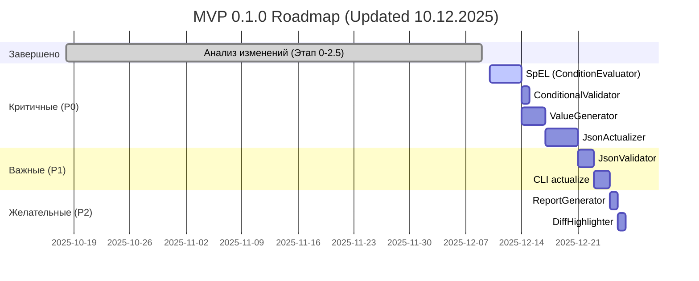

# Product Requirements Document (PRD)
# JSON Scenario Generator v0.1.0 - v1.0.0

**Версия документа:** 2.0  
**Дата создания:** 07 декабря 2025  
**Последнее обновление:** 10 декабря 2025, 02:25 MSK  
**Автор:** Chemixx  
**Статус:** 🚧 В разработке (45-50% MVP)  

---

## 📖 EXECUTIVE SUMMARY

**Название проекта:** JSON Scenario Generator  
**Цель:** Автоматизация актуализации JSON-сценариев кредитного конвейера при изменении версий JSON Schema  
**Целевая аудитория:** QA-инженеры, Backend-разработчики, DevOps  
**MVP Focus:** Актуализация существующих JSON (НЕ генерация новых)  

**Бизнес-проблема:**  
При выходе новой версии JSON Schema (например, V070 → V072) требуется **вручную** обновить 100+ тестовых JSON-сценариев, что занимает **3 дня** и содержит **ошибки**.

**Решение:**  
CLI-инструмент для **автоматической** актуализации JSON-сценариев за **5 минут** с **нулевыми ошибками** валидации.

**Ключевые метрики успеха:**
- ⏱️ **Время актуализации:** 3 дня → 5 минут (93% экономия)
- ✅ **Точность:** 0 ошибок валидации
- 🧪 **Покрытие тестами:** 100% (153+ unit-тестов)

---

## 📋 MVP SCOPE

### **MVP 0.1.0 — "Актуализатор" (16-20 дней)**

**Основной use case:**
> У меня есть 100 готовых JSON-сценариев версии V070 из Postman.  
> Вышла новая версия схемы V072 с новыми обязательными полями.  
> **Мне нужно автоматически обновить все 100 файлов за минуты, а не дни.**

---

#### **Must-Have компоненты:**

**1. Анализ изменений** ✅ **ЗАВЕРШЕНО (10 декабря 2025)**

- [x] `SchemaParser` — парсинг любой версии JSON Schema (12 unit-тестов)
- [x] `SchemaComparator` — сравнение двух версий (20 unit-тестов)
- [x] `ChangeAnalyzer` — 3-level classification (69 unit-тестов)
  - **ChangeType:** ADDITION / REMOVAL / MODIFICATION (что произошло)
  - **BreakingLevel:** BREAKING / NON_BREAKING (ломает API или нет)
  - **ImpactLevel:** CRITICAL / HIGH / MEDIUM / LOW (насколько критично)
- [x] **`ReportFormatter`** — модульное форматирование (12 unit-тестов) ✅ **НОВОЕ**
  - `format_text()` — консольный вывод с эмодзи
  - `format_markdown()` — GitHub-friendly Markdown
  - `format_json()` — JSON для API/интеграций
- [x] `analyze_changes.py` — CLI для анализа

**Итого:** 113 unit-тестов, 100% pass rate

**Статус:** ✅ **ЗАВЕРШЕНО** (Этап 0-2.5)

---

**2. Актуализация** 🔴 **КРИТИЧНО (10-12 дней)**

- [ ] `ConditionParser` ✅ (уже готов, 42 теста)
- [ ] `ConditionEvaluator` — выполнение SpEL (3-4 дня) 🔴 **В РАБОТЕ**
- [ ] `SpELFunctions` — 34 оператора (1-2 дня) 🔴 **В РАБОТЕ**
- [ ] `ConditionalValidator` — проверка УО полей (1 день) ⏳ **ОЖИДАЕТ**
- [ ] `ValueGenerator` — генерация значений для новых полей (2-3 дня) ⏳ **ОЖИДАЕТ**
- [ ] `JsonActualizer` — применение diff к JSON (3-4 дня) ⏳ **ОЖИДАЕТ**

**Статус:** 🔴 **В РАБОТЕ** (Этап 3.1-3.4)

---

**3. Валидация** 🟡 **ВАЖНО (2-3 дня)**

- [ ] `JsonValidator` — проверка JSON Schema + SpEL (2 дня) ⏳ **ОЖИДАЕТ**
- [ ] Отчет о валидации (1 день) ⏳ **ОЖИДАЕТ**

**Статус:** 🟡 **ЗАПЛАНИРОВАНО** (Этап 3.5)

---

**4. CLI** 🟡 **ВАЖНО (2-3 дня)**

- [x] `cli/main.py` с командой `compare` ✅ (уже есть в analyze_changes.py)
- [ ] Команда `actualize` 🔴 **КРИТИЧНО** (Этап 3.6)
- [ ] Команда `validate` 🟡 **ЖЕЛАТЕЛЬНО**

**Статус:** 🟡 **ЧАСТИЧНО** (compare готов, actualize в работе)

---

**5. Отчетность** 🟢 **ЖЕЛАТЕЛЬНО (2-3 дня)**

- [x] `ReportFormatter` ✅ **ЗАВЕРШЕНО** (text/markdown/json)
- [ ] `ReportGenerator` — расширенные Markdown-отчеты ⏳ **ОПЦИОНАЛЬНО**
- [ ] `DiffHighlighter` — side-by-side JSON ⏳ **ОПЦИОНАЛЬНО**

**Статус:** 🟢 **ЧАСТИЧНО** (базовое форматирование готово)

---

**ИТОГО MVP:** **16-20 дней** (без генератора)

---

### **Версия 0.2.0 — "Генератор" (опционально, 10-15 дней)**

**Use case:**
> Я хочу сгенерировать тестовые сценарии для всех комбинаций продуктов автоматически,  
> чтобы не писать JSON вручную.

#### **Should-Have компоненты:**

**1. Базовая генерация**

- [ ] `ScenarioGenerator` — генерация min/max сценариев
- [ ] Генерация для одного продукта (без комбинаторики)
- [ ] CLI: `generate --schema V072.json --product 10410001 --type min`

**2. Комбинаторная генерация**

- [ ] `CallMappingLoader` — загрузка Лист 19 Excel
- [ ] `isValidCombination()` — бизнес-правила
- [ ] Генерация матрицы: productCd × loanTypeCd × channelCd
- [ ] CLI: `generate-all --products 10410001,10410002`

**Статус:** ⏳ **ОТЛОЖЕНО ДО ЯНВАРЯ 2026**

---

### **Версия 1.0.0 — "Конфигуратор" (идея на будущее, 15-20 дней)**

**Use case:**
> Я хочу гибко настраивать, какие поля/комбинации генерировать,  
> без редактирования кода или Excel.

#### **Could-Have компоненты:**

**1. Конфигурационный YAML**

```yaml
# config/generation_rules.yml
version: "072"
scenarios:
  - name: "PACL Web MDM Min"
    product_cd: 10410001
    loan_type_cd: 10340001
    channel_cd: 10430001
    client_type: "mdm"
    fields:
      include:
        - loanRequest.creditAmt
        - loanRequest.customerForms
      exclude:
        - loanRequest.pledges  # явно исключить
    type: min
```

**2. Интерактивный CLI (Rich library)**

```bash
$ python -m src.cli generate --interactive

? Select product: 
  ❯ PACL (10410001)
    PACC (10410002)
    POS (10410005)

? Select channels (space to select):
  [x] Web (10430001)
  [ ] Office (10430003)
  [x] Mobile (10430002)

? Select fields to include:
  [x] loanRequest.creditAmt (required)
  [x] loanRequest.customerForms (required)
  [ ] loanRequest.pledges (optional)
  [x] loanRequest.consents (conditional)

Generating 2 scenarios (PACL_Web_min, PACL_Mobile_min)...
```

**3. Web UI (опционально)**

- Визуальный конструктор сценариев
- Дерево полей с чекбоксами
- Предпросмотр JSON в реальном времени

**Статус:** 💡 **ИДЕЯ НА Q1 2026**

---

## 🎯 ОБНОВЛЕННЫЕ ПРИОРИТЕТЫ

### **КРИТИЧНЫЕ (блокируют MVP):**

| Приоритет | Компонент | Дни | Статус | Зависимости |
|-----------|-----------|-----|--------|-------------|
| **P0** | `ConditionEvaluator` + `SpELFunctions` | 4 | 🔴 **В РАБОТЕ** | ConditionParser ✅ |
| **P0** | `ConditionalValidator` | 1 | ⏳ **ОЖИДАЕТ** | ConditionEvaluator (P0) |
| **P0** | `ValueGenerator` | 3 | ⏳ **ОЖИДАЕТ** | DictionaryLoader ✅, ConditionEvaluator (P0) |
| **P0** | `JsonActualizer` | 4 | ⏳ **ОЖИДАЕТ** | ValueGenerator (P0), ConditionalValidator (P0) |
| **P1** | `JsonValidator` | 2 | ⏳ **ОЖИДАЕТ** | ConditionalValidator (P0) |
| **P1** | CLI `actualize` | 2 | ⏳ **ОЖИДАЕТ** | JsonActualizer (P0) |

**ИТОГО P0-P1:** **16 дней** → **MVP 0.1.0**

---

### **Критический путь (Waterfall Dependencies)**

```
ConditionParser ✅ (42 теста)
    ↓
ConditionEvaluator (P0, 4 дня) 🔴 В РАБОТЕ
    ↓
    ├→ ConditionalValidator (P0, 1 день)
    ├→ ValueGenerator (P0, 3 дня)
    │     ↓
    │  JsonActualizer (P0, 4 дня)
    │     ↓
    ├→ JsonValidator (P1, 2 дня)
    ↓
CLI actualize (P1, 2 дня)
```

**Дедлайн MVP:** 16 дней от старта ConditionEvaluator (10 декабря) → **26 декабря 2025**

**Риск:** ConditionEvaluator блокирует 4 других компонента. Задержка на 1 день → сдвиг дедлайна на 1 день.

---

### **ВАЖНЫЕ (желательно для MVP, но можно отложить):**

| Приоритет | Компонент | Дни | Версия |
|-----------|-----------|-----|--------|
| **P2** | `ReportGenerator` (Markdown) | 1 | 0.1.0 или 0.2.0 |
| **P2** | `DiffHighlighter` | 1 | 0.1.0 или 0.2.0 |
| **P2** | CLI `validate` | 1 | 0.1.0 или 0.2.0 |

---

### **ОПЦИОНАЛЬНЫЕ (будущие версии):**

| Приоритет | Компонент | Дни | Версия |
|-----------|-----------|-----|--------|
| **P3** | `ScenarioGenerator` (базовый) | 3 | 0.2.0 |
| **P3** | `CallMappingLoader` | 2 | 0.2.0 |
| **P3** | Комбинаторика | 5 | 0.2.0 |
| **P4** | Конфигурационный YAML | 3 | 1.0.0 |
| **P4** | Интерактивный CLI | 5 | 1.0.0 |
| **P4** | Web UI | 15 | 1.0.0+ |

---

## 📊 ОБНОВЛЕННЫЙ ROADMAP

### **Фаза 1: MVP 0.1.0 "Актуализатор" (16-20 дней)**



**Дедлайн MVP:** **25-27 декабря 2025**

---

### **Фаза 2: Версия 0.2.0 "Генератор" (январь 2026, опционально)**

```
Неделя 1-2 (10-15 дней):
- ScenarioGenerator (базовый)
- CallMappingLoader (если нужен)
- Генерация min/max для одного продукта
- CLI: generate --product X
```

---

### **Фаза 3: Версия 1.0.0 "Конфигуратор" (февраль-март 2026, идея)**

```
Месяц 1-2 (20-30 дней):
- Конфигурационный YAML
- Интерактивный CLI (Rich library)
- Опционально: Web UI (FastAPI + React)
```

---

## ✅ КРИТЕРИИ УСПЕХА MVP 0.1.0

### **Функциональные критерии**

**Обязательные (Must-Have):**

- [x] **Анализ:** Сравнение любых версий схем за < 5 сек ✅ **ВЫПОЛНЕНО**
- [x] **3-level classification:** ChangeType + BreakingLevel + ImpactLevel ✅ **ВЫПОЛНЕНО**
- [x] **Форматирование отчетов:** text, markdown, json ✅ **ВЫПОЛНЕНО**
- [ ] **Актуализация:** Обновление 100 JSON за < 5 минут 🔴 **КРИТИЧНО**
- [ ] **SpEL:** Поддержка 34 операторов с 100% тестовым покрытием 🔴 **КРИТИЧНО**
- [ ] **Генерация значений:** Все типы полей (string, int, dict, array, object) 🔴 **КРИТИЧНО**
- [ ] **UUID-связи:** Сохранение связей между Call0→Call1 🔴 **КРИТИЧНО**

**Желательные (Should-Have):**

- [ ] **Валидация:** Проверка 100 JSON за < 2 минуты 🟡 **ВАЖНО**
- [ ] **Отчет актуализации:** Markdown с деталями (Added/Removed/Modified) 🟡 **ВАЖНО**
- [ ] **CLI Rich UI:** Прогресс-бары, цветной вывод 🟡 **ВАЖНО**

**Опциональные (Nice-to-Have):**

- [ ] **DiffHighlighter:** Side-by-side JSON с ANSI-цветами 🟢 **ОПЦИОНАЛЬНО**
- [ ] **HTML-отчеты:** Визуализация изменений в браузере 🟢 **ОПЦИОНАЛЬНО**

---

### **Основной сценарий использования:**

```bash
# 1. Анализ изменений (уже работает ✅)
python scripts/analyze_changes.py \
  data/V070Call1Rq.json \
  data/V072Call1Rq.json \
  --format markdown \
  --output reports/changes.md

# 2. Актуализация (КРИТИЧНО для MVP 🔴)
python -m src.cli actualize \
  --old-schema data/V070Call1Rq.json \
  --new-schema data/V072Call1Rq.json \
  --scenario data/scenarios/call1_pacl_v070.json \
  --output output/call1_pacl_v072.json \
  --report reports/actualization.md

# 3. Валидация (желательно 🟡)
python -m src.cli validate \
  --schema data/V072Call1Rq.json \
  --json-file output/call1_pacl_v072.json
```

---

### **НЕ входит в MVP 0.1.0 (Out of Scope)**

**Функциональность:**

❌ Генерация новых сценариев с нуля  
❌ Комбинаторика продуктов × каналов  
❌ CallMappingLoader (Лист 19 Excel)  
❌ Интерактивный выбор полей (CLI)  
❌ Web UI (FastAPI + React)  
❌ Postman-интеграция (автоимпорт коллекций)  
❌ CI/CD pipeline для автоматического тестирования  

**Качество:**

❌ HTML-отчеты (только text/markdown/json)  
❌ Excel-экспорт diff (только Markdown)  
❌ Интерактивная визуализация изменений  
❌ Автоматическое резервное копирование JSON  

**Производительность:**

❌ Параллельная обработка 1000+ JSON  
❌ Инкрементальная актуализация (только full re-actualization)  
❌ Кэширование результатов анализа  

---

## 👤 USER STORIES

### **US-1: Анализ изменений между версиями** ✅ **ВЫПОЛНЕНО**

**Как:** QA-инженер  
**Я хочу:** сравнить две версии JSON Schema (V070 и V072)  
**Чтобы:** понять, какие изменения произошли и какие JSON-сценарии нужно обновить

**Acceptance Criteria:**

- [x] CLI принимает два JSON Schema файла любых версий (version-agnostic)
- [x] Вывод в форматах: text (консоль), markdown (документ), json (API)
- [x] 3-level классификация: ChangeType + BreakingLevel + ImpactLevel
- [x] Фильтры: `--only-critical`, `--only-breaking`
- [x] Время анализа < 5 секунд для схем размером ~70KB
- [x] Вербозный режим: `--verbose` с деталями изменений

**Пример:**

```bash
python scripts/analyze_changes.py \
  data/V070Call1Rq.json \
  data/V072Call1Rq.json \
  --format markdown \
  --only-breaking \
  --verbose
```

**Результат:**

```markdown
# JSON Schema Analysis Report

**Old Version:** V070Call1Rq.json  
**New Version:** V072Call1Rq.json  

## Summary
- Total Changes: 25
- Breaking Changes: 7 🔴
- Critical Changes: 2 ⚠️

## Critical Changes

1. **loanRequest/snils** — REMOVED
   - Type: REMOVAL
   - Breaking: BREAKING
   - Impact: HIGH
   - Reason: Removed required field
   - Recommendation: Remove from existing JSON, update documentation
```

**Статус:** ✅ **ВЫПОЛНЕНО** (10 декабря 2025)

---

### **US-2: Автоматическая актуализация JSON-сценариев** 🔴 **В РАБОТЕ**

**Как:** QA-инженер  
**Я хочу:** автоматически обновить 100 JSON-сценариев V070 → V072  
**Чтобы:** не тратить 3 дня на ручное редактирование

**Acceptance Criteria:**

- [ ] CLI принимает старую/новую схемы + JSON-сценарий
- [ ] Добавляет новые обязательные поля с валидными значениями
- [ ] Удаляет устаревшие поля (с логированием старых значений)
- [ ] Обрабатывает изменения типов (integer → string)
- [ ] Сохраняет UUID-связи между Call0→Call1→Call2
- [ ] Время обработки 100 JSON < 5 минут
- [ ] Отчет: Added/Removed/Modified с путями и значениями
- [ ] Валидация результата (JSON Schema + SpEL)

**Пример:**

```bash
python -m src.cli actualize \
  --old-schema data/V070Call1Rq.json \
  --new-schema data/V072Call1Rq.json \
  --scenario data/scenarios/call1_pacl_v070.json \
  --output output/call1_pacl_v072.json \
  --report reports/actualization.md
```

**Результат (отчет):**

```markdown
# Actualization Report

**Scenario:** call1_pacl_v070.json → call1_pacl_v072.json

## Summary
- Added: 15 fields
- Removed: 3 fields
- Modified: 7 fields
- Validation: ✅ PASSED

## Details

### Added Fields
1. `loanRequest/newField` = "generated_value_123" (type: string, maxLength: 50)
2. `loanRequest/anotherField` = 10410001 (type: integer, dictionary: PRODUCTCD)
...

### Removed Fields
1. `loanRequest/snils` (was: "12345678901")
...

### Modified Fields
1. `loanRequest/creditAmt` (type changed: integer → string)
   - Old: 100000
   - New: "100000"
```

**Статус:** 🔴 **В РАБОТЕ** (Этап 3, зависит от ConditionEvaluator)

---

### **US-3: Валидация JSON по схеме + SpEL** 🟡 **ЗАПЛАНИРОВАНО**

**Как:** Backend-разработчик  
**Я хочу:** проверить, что JSON-сценарий соответствует схеме V072  
**Чтобы:** убедиться, что актуализация прошла корректно и JSON можно использовать в тестах

**Acceptance Criteria:**

- [ ] Валидация по JSON Schema Draft 2019-09 (стандартные constraints)
- [ ] Валидация conditionalRequirement (34 SpEL-оператора)
- [ ] Понятные сообщения об ошибках с путями и dqCode
- [ ] Время валидации 100 JSON < 2 минуты
- [ ] CLI вывод: список ошибок + статистика (passed/failed)
- [ ] Exit code: 0 (success), 1 (validation errors)

**Пример:**

```bash
python -m src.cli validate \
  --schema data/V072Call1Rq.json \
  --json-file output/call1_pacl_v072.json
```

**Результат (success):**

```
✅ Validation PASSED
- JSON Schema: ✅ VALID
- Conditional Requirements: ✅ VALID (34 SpEL checks)

Statistics:
- Total fields validated: 150
- Errors: 0
```

**Результат (errors):**

```
❌ Validation FAILED

Errors:
1. loanRequest/pledges: Залог обязателен для кредита наличными (dqCode: DQ_PLEDGE_REQUIRED)
   - Condition: eq(root.loanRequest.creditParameters[0].loanTypeCd, 10340001)
   - Actual value: null

2. loanRequest/creditAmt: Value exceeds maximum (dqCode: DQ_CREDIT_AMT_MAX)
   - Constraint: maximum = 1000000
   - Actual value: 1500000

Statistics:
- Total fields validated: 150
- Errors: 2
```

**Статус:** 🟡 **ЗАПЛАНИРОВАНО** (Этап 3.5, зависит от ConditionalValidator)

---

## ⚠️ РИСКИ И МИТИГАЦИИ

| Риск | Вероятность | Влияние | Митигация |
|------|-------------|---------|-----------||
| **ConditionEvaluator занимает > 4 дней** | Высокая | CRITICAL | Параллельная разработка тестов; упрощение сложных операторов (например, `matches` → regex subset); daily standups для отслеживания прогресса |
| **SpEL-выражения некорректно выполняются** | Средняя | CRITICAL | 100% тестовое покрытие 34 операторов; примеры из реальных схем V072; peer review кода |
| **UUID-связи теряются при актуализации** | Средняя | HIGH | Кэширование UUID в ValueGenerator; unit-тесты для Call0→Call1 связей; интеграционный E2E тест |
| **JSON Schema Draft 2019-09 не покрывает все случаи** | Низкая | MEDIUM | Дополнительная валидация через ConditionalValidator; расширение схемы при необходимости |
| **Дедлайн 25 декабря слишком агрессивный** | Высокая | HIGH | MVP можно сузить: убрать JsonValidator (P1) и DiffHighlighter (P2); перенести на 27 декабря |
| **Недостаточно тестовых данных для валидации** | Средняя | MEDIUM | Использовать реальные JSON-сценарии из Postman (100+ файлов); генерация edge cases через Faker |

**Митигация критического риска (ConditionEvaluator):**

1. **День 1:** Реализация 10 базовых операторов (in, eq, and, or, not, isNull)
2. **День 2:** Навигация по JSON (this, root, parent, field[0])
3. **День 3:** Сложные операторы (anyMatch, allMatch, matches)
4. **День 4:** Баг-фиксинг + интеграция с ConditionalValidator

**Checkpoint:** Если к концу Дня 2 навигация не работает → упростить до `this.field` только.

---

## 📈 МЕТРИКИ УСПЕХА MVP

### **Функциональные метрики**

| Метрика | Цель | Текущее | Статус |
|---------|------|---------|--------|
| **Анализ схем** | < 5 сек для 70KB | ~2 сек | ✅ ДОСТИГНУТО |
| **Актуализация 100 JSON** | < 5 минут | — | 🔴 В РАБОТЕ |
| **Валидация 100 JSON** | < 2 минуты | — | 🟡 ЗАПЛАНИРОВАНО |
| **SpEL операторы** | 34/34 поддержаны | 0/34 | 🔴 В РАБОТЕ |
| **Тестовое покрытие (этап 0-2.5)** | 100% | 100% (153 теста) | ✅ ДОСТИГНУТО |
| **Тестовое покрытие (этап 3)** | 100% | 0% | 🔴 В РАБОТЕ |

---

### **Качественные метрики**

| Метрика | Цель | Текущее | Статус |
|---------|------|---------|--------|
| **Архитектура** | SOLID, модульность | Достигнуто | ✅ ДОСТИГНУТО |
| **Документация (код)** | Docstrings везде | Достигнуто | ✅ ДОСТИГНУТО |
| **Документация (проект)** | README + ARCHITECTURE + DEVELOPMENT + PRD | Достигнуто | ✅ ДОСТИГНУТО |
| **CLI UX** | Rich UI, прогресс-бары | — | 🟡 ЗАПЛАНИРОВАНО |
| **Обработка ошибок** | Понятные сообщения | Частично | 🟡 ЗАПЛАНИРОВАНО |

---

### **Бизнес-метрики**

| Метрика | Цель | Текущее | Статус |
|---------|------|---------|--------|
| **Экономия времени** | 3 дня → 5 минут (93%) | — | 🔴 В РАБОТЕ |
| **Точность актуализации** | 0 ошибок валидации | — | 🔴 В РАБОТЕ |
| **Покрытие продуктов** | 80% комбинаций | — | ⏳ v0.2.0 |

**Формула ROI:**

```
Время ручной актуализации: 3 дня × 8 часов = 24 часа
Время автоматической актуализации: 5 минут = 0.083 часа
Экономия времени: 24 - 0.083 = 23.92 часа (99.65%)

Стоимость часа QA-инженера: ~$20
Экономия за 1 актуализацию: 23.92 × $20 = $478
Частота актуализаций: ~6 раз в год
Годовая экономия: $478 × 6 = $2868
```

---

## 🔍 КОНКУРЕНТЫ И АЛЬТЕРНАТИВЫ

### **Существующие решения**

| Решение | Что делает | Недостатки | Наше преимущество |
|---------|-----------|-----------|-------------------|
| **Ручное редактирование (Postman)** | Копипаста + замена полей | 3 дня на 100 JSON, ошибки | ✅ Автоматизация за 5 минут |
| **JSON Schema Diff (npm)** | Сравнение схем | Только diff, без актуализации | ✅ Актуализация + валидация |
| **OpenAPI Generator** | Генерация кода из OpenAPI | Не для тестовых данных | ✅ Специально для JSON-сценариев |
| **jq (CLI tool)** | Трансформация JSON | Низкоуровневый, нет SpEL | ✅ High-level, SpEL-валидация |

---

### **Почему не использовать существующие?**

1. **JSON Schema Diff** — показывает изменения, но **не обновляет JSON**
2. **jq** — требует написания сложных скриптов для каждой версии схемы
3. **OpenAPI Generator** — для генерации кода, а не тестовых данных
4. **Ручная работа** — неэффективно для 100+ JSON

**Наше решение:**  
Специализированный инструмент для **актуализации** JSON-сценариев кредитного конвейера с **SpEL-валидацией** и **автогенерацией** значений.

---

## 💡 ИДЕИ ДЛЯ ВЕРСИИ 1.0.0

### **Идея 1: Конфигурируемая генерация комбинаций**

**Концепция:**
> Пользователь выбирает из UI/CLI, какие атрибуты комбинировать для генерации сценариев,  
> вместо жесткого хардкода "productCd × loanTypeCd × channelCd".

**Реализация (версия 1.0.0):**

```yaml
# config/generation_config.yml
version: "072"

# Доступные измерения для комбинаторики
dimensions:
  product:
    field: loanRequest.creditParameters[0].productCdExt
    values:
      - 10410001  # PACL
      - 10410002  # PACC
      - 10410005  # POS
  
  loan_type:
    field: loanRequest.creditParameters[0].loanTypeCd
    values:
      - 10340001  # Кредит наличными
      - 10340002  # Рефинансирование
  
  channel:
    field: loanRequest.channelCd
    values:
      - 10430001  # Web
      - 10430002  # Mobile
      - 10430003  # Office

# Какие комбинации генерировать
scenarios:
  - name: "Базовые продукты × Каналы"
    combine: [product, channel]
    filters:
      - "product == 10410002 and channel != 10430003"  # PACC не с Office
```

**CLI:**

```bash
# Генерация по конфигу
python -m src.cli generate-from-config \
  --config config/generation_config.yml \
  --schema data/V072Call1Rq.json \
  --output-dir output/scenarios

# Или интерактивный выбор
python -m src.cli generate --interactive
? Select dimensions to combine:
  [x] product
  [x] channel
  [ ] loan_type
  
Generating 9 scenarios (3 products × 3 channels)...
```

**Преимущества:**

- ✅ Гибкость: пользователь сам решает, что комбинировать
- ✅ Масштабируемость: легко добавить новые измерения
- ✅ Без изменения кода: всё в конфиге

---

### **Идея 2: Версионные атрибуты**

**Концепция:**
> Разные версии схем имеют разные наборы полей.  
> При генерации для V072 нужно знать, что `snils` уже нет, а `newField` появилось.

**Реализация:**

```yaml
# config/version_fields.yml
V070:
  available_fields:
    - loanRequest.snils
    - loanRequest.creditAmt
  unavailable_fields:
    - loanRequest.newField  # появится в V072

V072:
  available_fields:
    - loanRequest.creditAmt
    - loanRequest.newField
  unavailable_fields:
    - loanRequest.snils  # удалено в V072
```

**UI (версия 1.0.0):**

```
┌─────────────────────────────────────────┐
│ Select version: V072                    │
├─────────────────────────────────────────┤
│ Available fields for generation:        │
│ [x] loanRequest.creditAmt (required)    │
│ [x] loanRequest.newField (required)     │
│ [ ] loanRequest.pledges (optional)      │
│                                         │
│ ⚠️  Not available in V072:              │
│     loanRequest.snils (removed)         │
└─────────────────────────────────────────┘
```

---

## 🎯 ФИНАЛЬНЫЙ ФОКУС ДЛЯ MVP

**ТРИ КЛЮЧЕВЫЕ ФУНКЦИИ:**

1. **Анализ:** "Покажи мне, что изменилось между V070 и V072" ✅ **ГОТОВО**
2. **Актуализация:** "Обнови мои 100 JSON V070 → V072 автоматически" 🔴 **ФОКУС MVP**
3. **Валидация:** "Проверь, что обновленные JSON корректны" 🟡 **ЖЕЛАТЕЛЬНО**

**Генерация новых сценариев** — это **отдельный продукт**, который можно сделать в версии 0.2.0,  
когда основная функция уже работает и стабильна.

---

## ✅ ИТОГОВЫЕ ИЗМЕНЕНИЯ PRD

### **Что убираем из MVP:**

- ❌ EPIC 4: Генерация тестовых сценариев
- ❌ TASK 4.1: ScenarioGenerator
- ❌ TASK 4.2: CallMappingLoader
- ❌ US-4.1, US-4.2, US-4.3, US-4.4 (все истории генерации)

### **Что оставляем в MVP:**

- ✅ EPIC 1: Анализ изменений (завершено)
- ✅ EPIC 2: Актуализация JSON (критично)
- ✅ EPIC 3: Валидация JSON (важно)
- ✅ EPIC 5: Работа с справочниками (нужно для ValueGenerator)
- ✅ EPIC 6: Отчетность (ReportFormatter завершен)

### **Что переносим в 0.2.0:**

- ⏳ EPIC 4: Генерация тестовых сценариев
- ⏳ CallMappingLoader (опционально, если нужен)

### **Что добавляем в 1.0.0 (идеи):**

- 💡 Конфигурируемая комбинаторика (YAML)
- 💡 Интерактивный выбор полей (CLI)
- 💡 Версионные атрибуты (доступные поля по версиям)
- 💡 Web UI для настройки генерации

---

## 📝 CHANGELOG PRD

### **Version 2.0 (10 декабря 2025)**

**Обновления:**
- ✅ Обновлен статус компонентов: добавлен ReportFormatter (12 тестов)
- ✅ Обновлены приоритеты: статусы P0-P1 (🔴 В РАБОТЕ → ⏳ ОЖИДАЕТ)
- ✅ Обновлен Roadmap: даты 10-27 декабря 2025, добавлен baseline (Этап 0-2.5)
- ✅ Обновлены критерии успеха: разделение Must/Should/Nice-to-Have
- ✅ Добавлены User Stories: US-1, US-2, US-3 с acceptance criteria
- ✅ Добавлена секция "Риски и митигации": 6 рисков с митигациями
- ✅ Добавлена секция "Метрики успеха": функциональные, качественные, бизнес
- ✅ Добавлена секция "Конкуренты и альтернативы": обоснование необходимости
- ✅ Расширена секция "НЕ входит в MVP": 3 категории (функциональность, качество, производительность)

**Удалено:**
- ❌ Генерация сценариев из MVP 0.1.0 (перенесено в v0.2.0)

---

### **Version 1.0 (07 декабря 2025)**

**Создание:**
- Первая версия PRD с фокусом на актуализацию JSON
- Описание MVP 0.1.0, версий 0.2.0, 1.0.0
- Roadmap, приоритеты, критерии успеха

---

**Последнее обновление:** 10 декабря 2025, 02:25 MSK  
**Статус документа:** ✅ Актуален  
**Следующий review:** После завершения ЭТАПА 3 (SpEL и актуализация)